# 1.数据结构

## 1.1 树

### 1.1.1 前中后序遍历

### 1.1.2 DFS BFS

### 1.1.3 层次遍历

### 1.1.4 哈夫曼树

## 1.2 图

### 1.2.1 图的DFS BFS

### 1.2.2 最小生成树

### 1.2.3 最短路径

## 1.3 排序算法

### 1.3.1 插入类排序算法

### 1.3.2 选择类排序

### 1.3.3 交换类排序

### 1.3.4 其他排序

## 1.4 查找方法

### 1.4.1 平衡二叉树 红黑树

#### 什么是平衡二叉树？

平衡二叉树又称为AVL树，是一种特殊的二叉排序树。其左右子树都是平衡二叉树，且左右子树的高度之差饿绝对值不超过1。一句话表述为：以书中所有节点的根的左右子树的高度之差的绝对值不超过1。

#### 为什么要使用红黑树？

因为，二叉查找树在某些情况下可能退化为线性。

在理想的情况下，二叉查找树增删查改的时间复杂度为O(logN)（其中N为节点数），最坏的情况下为O(N)。当它的高度为logN+1时，我们就说二叉查找树是平衡的。

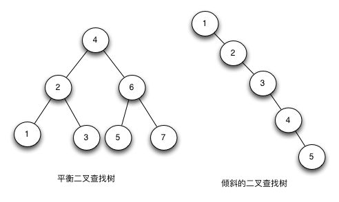

基于BST存在的问题，一种新的树——平衡二叉查找树(Balanced BST)产生了。平衡树在插入和删除的时候，会通过旋转操作将高度保持在logN。其中两款具有代表性的平衡树分别为AVL树和红黑树。AVL树由于实现比较复杂，而且插入和删除性能差，在实际环境下的应用不如红黑树。

#### 什么是红黑树？（自平衡二叉查找树）

1.节点是红色或黑色。

2.根节点是黑色。

3.每个叶子节点都是黑色的空节点（NIL节点）。

4 每个红色节点的两个子节点都是黑色。(从每个叶子到根的所有路径上不能有两个连续的红色节点)

5.从任一节点到其每个叶子的所有路径都包含相同数目的黑色节点。

**因为这些规则的限制，才保证了红黑树的自平衡。红黑树从根到叶子的最长路径不会超过最短路径的2倍。**

红黑树维持自身性质的两大方式：

- 自旋（左旋和右旋）
- 变色

### 1.4.2 B树 B+树 

###  1.4.3 哈希表

# 2. 计算机网络

## 2.1 IP

### 2.11 RIP  与 OSPF

先了解名称：

- RIP（路由信息协议）——分布式的基于距离向量的路由选择协议；
- OSPF（开放最短路径优先协议）—— 使用分布式的基于链路状态的路由选择协议

工作核心不同：

- RIP：数跳数；
- OSPF：计算链路的度量值

向谁发？

- RIP：仅和**相邻路由器**交换信息；
- OSPF：向本自治系统**所有路由器**发送消息，由于路由器发送的链路状态信息只能单向传送，OSPF不存在“坏消息传播得慢”的问题，更新过程的收敛性得到保证。

发什么？

- RIP：路由器交换的信息是当前**本路由器**所知道的全部信息，即自己现在的路由表
- OSPF：发送的信息是与本路由器**相邻的所有路由器**的链路状态 ，只涉及与相邻路由器的连通状态，与整个互联网的规模无关。

什么时候发？

- RIP：按固定的时间间隔交换路由信息（当网络拓扑发生变化时，路由器也及时向相邻路由器通告拓扑变化后的路由信息）

- OSPF：在网络刚刚启动计算第一次路由表时，一定发路由信息。只有当链路状态发生变化时，路由器才能向所有路由器用洪泛法发送此消息。（链路状态：说明本路由器都和哪些路由器相邻以及该链路的度量）

范围;

- RIP：限制了网络规模，能使用的最大距离为15,16表示不可达
- OSPF：链路的度量可以是1~65 535中的任何一个无量纲的数，可供管理人员来决定。因此十分灵活。

数据包传输层：

- RIP协议使用运输层的用户数据包UDP来进行传送
- OSPF的位置在网络层，直接用IP数据报传送(其IP数据报首部的协议字段值为89)。由于OSPF构成的数据报很短，不仅减少了路由信息的通信量，而且在传送中不必分片，不会出现一片丢失而重传整个数据报的现象。

## 2.2 TCP

## 2.3 应用层

### 2.3.1  http1.0 和 http1.1有什么区别？

长连接：

- 在HTTP1.1中默认开启长连接keep-alive，一定程度上弥补了HTTP1.0每次请求都要创建连接的缺点。HTTP1.0需要使用keep-alive参数来告知服务器端要建立一个长连接。

节约带宽：

- HTTP1.0中存在一些浪费带宽的现象，例如客户端只是需要某个对象的一部分，而服务器却将整个对象送过来了，并且不支持断点续传功能。HTTP1.1支持只发送header信息（不带任何body信息），如果服务器认为客户端有权限请求服务器，则返回100，客户端接收到100才开始把请求body发送到服务器；如果返回401，客户端就可以不用发送请求body了节约了带宽。

HOST域：

- 在HTTP1.0中认为每台服务器都绑定一个唯一的IP地址，因此，请求消息中的URL并没有传递主机名（hostname），HTTP1.0没有host域。随着虚拟主机技术的发展，在一台物理服务器上可以存在多个虚拟主机（Multi-homed Web Servers），并且它们共享一个IP地址。HTTP1.1的请求消息和响应消息都支持host域，且请求消息中如果没有host域会报告一个错误（400 Bad Request）。

缓存处理：

- 在HTTP1.0中主要使用header里的If-Modified-Since,Expires来做为缓存判断的标准，HTTP1.1则引入了更多的缓存控制策略例如Entity tag，If-Unmodified-Since, If-Match, If-None-Match等更多可供选择的缓存头来控制缓存策略。

错误通知的管理：（增加了状态码）

- 在HTTP1.1中新增了24个错误状态响应码，如409（Conflict）表示请求的资源与资源的当前状态发生冲突；410（Gone）表示服务器上的某个资源被永久性的删除。

### 2.3.2 HTTP1.1和HTTP2.0的区别

多路复用

- HTTP2.0使用了多路复用的技术，做到同一个连接并发处理多个请求，而且并发请求的数量比HTTP1.1大了好几个数量级。HTTP1.1也可以多建立几个TCP连接，来支持处理更多并发的请求，但是创建TCP连接本身也是有开销的。

头部数据压缩：

-  HTTP1.1不支持header数据的压缩，HTTP2.0使用HPACK算法对header的数据进行压缩，这样数据体积小了，在网络上传输就会更快。对Cookie，UserAgent等内容进行压缩。

**新的二进制格式**（Binary Format）：

- HTTP1.x的解析是基于文本。基于文本协议的格式解析存在天然缺陷，文本的表现形式有多样性，要做到健壮性考虑的场景必然很多，二进制则不同，只认0和1的组合。基于这种考虑HTTP2.0的协议解析决定采用二进制格式，实现方便且健壮。

服务器推送：

       服务端推送是一种在客户端请求之前发送数据的机制。网页使用了许多资源：HTML、样式表、脚本、图片等等。在HTTP1.1中这些资源每一个都必须明确地请求。这是一个很慢的过程。浏览器从获取HTML开始，然后在它解析和评估页面的时候，增量地获取更多的资源。因为服务器必须等待浏览器做每一个请求，网络经常是空闲的和未充分使用的。
    
       为了改善延迟，HTTP2.0引入了server push，它允许服务端推送资源给浏览器，在浏览器明确地请求之前，免得客户端再次创建连接发送请求到服务器端获取。这样客户端可以直接从本地加载这些资源，不用再通过网络


### 2.3.3 **HTTP2.0的多路复用和HTTP1.X中的长连接复用有什么区别？**

- HTTP/1.* 一次请求-响应，建立一个连接，用完关闭；每一个请求都要建立一个连接；
- HTTP/1.1 Pipeling解决方式为，若干个请求排队串行化单线程处理，后面的请求等待前面请求的返回才能获得执行机会，一旦有某请求超时等，后续请求只能被阻塞，毫无办法，也就是人们常说的线头阻塞；
- HTTP/2多个请求可同时在一个连接上并行执行。某个请求任务耗时严重，不会影响到其它连接的正常执行；具体如图：


### 2.3.3 http和https有什么区别？

一般来说，网络安全关心三个问题：保密性、完整性、可用性（CIA confidentiality, integrity, availability)

HTTPS缺省工作在TCP协议443端口，它的工作流程一般如以下方式：

- 1） 完成TCP三次同步握手
- 2） 客户端验证服务器数字证书，通过，进入步骤3
- 3） DH算法协商对称加密算法的密钥、hash算法的密钥
- 4） SSL安全加密隧道协商完成
- 5）网页以加密的方式传输，用协商的对称加密算法和密钥加密，保证数据机密性；用协商的hash算法进行数据完整性保护，保证数据不被篡改

如果HTTPS是网银服务，以上SSL安全隧道成功建立才会要求用户输入账户信息，账户信息是在安全隧道里传输，所以不会泄密！

端口不同：

- http 80端口
- https 443 端口

传输信息安全性不同:

- 1、http协议：是超文本传输协议，信息是明文传输。如果攻击者截取了Web浏览器和网站服务器之间的传输报文，就可以直接读懂其中的信息。
- 2、https协议：是具有安全性的ssl加密传输协议，为浏览器和服务器之间的通信加密，确保数据传输的安全。

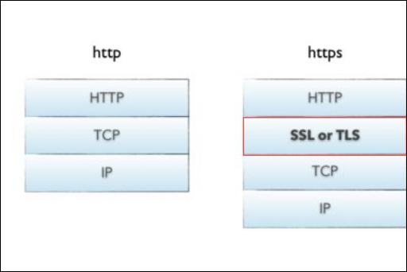

连接方式不同:

- 1、http协议：http的连接很简单，是无状态的。
- 2、https协议：是由SSL＋HTTP协议构建的可进行加密传输、身份认证的网络协议。

证书申请方式不同：

- 1、http协议：免费申请。
- 2、https协议：需要到ca申请证书，一般免费证书很少，需要交费。

# 3.MySQL

## 3.1 MySQL索引

### 3.1.1 什么是索引？

索引是一种特殊的数据库结构，由数据表中的一列或多列组合而成，可以用来快速查询数据表中有某一特定值的记录。本节将详细讲解索引的含义、作用和优缺点。

通过索引，查询数据时不用读完记录的所有信息，而只是查询索引列。否则，数据库系统将读取每条记录的所有信息进行匹配。

可以把索引比作新华字典的音序表。例如，要查“库”字，如果不使用音序，就需要从字典的 400 页中逐页来找。但是，如果提取拼音出来，构成音序表，就只需要从 10 多页的音序表中直接查找。这样就可以大大节省时间。

因此，使用索引可以很大程度上提高数据库的查询速度，还有效的提高了数据库系统的性能。

### 3.1.2 为什么使用索引？

索引就是根据表中的一列或若干列按照一定顺序建立的列值与记录行之间的对应关系表，实质上是一张描述索引列的列值与原表中记录行之间一 一对应关系的有序表。

索引是 MySQL 中十分重要的数据库对象，是数据库性能调优技术的基础，常用于实现数据的快速检索。

在 MySQL 中，通常有以下两种方式访问数据库表的行数据：

#### 1) 顺序访问

顺序访问是在表中实行全表扫描，从头到尾逐行遍历，直到在无序的行数据中找到符合条件的目标数据。

顺序访问实现比较简单，但是当表中有大量数据的时候，效率非常低下。例如，在几千万条数据中查找少量的数据时，使用顺序访问方式将会遍历所有的数据，花费大量的时间，显然会影响数据库的处理性能。

#### 2) 索引访问

索引访问是通过遍历索引来直接访问表中记录行的方式。

使用这种方式的前提是对表建立一个索引，在列上创建了索引之后，查找数据时可以直接根据该列上的索引找到对应记录行的位置，从而快捷地查找到数据。索引存储了指定列数据值的指针，根据指定的排序顺序对这些指针排序。

例如，在学生基本信息表 tb_students 中，如果基于 student_id 建立了索引，系统就建立了一张索引列到实际记录的映射表。当用户需要查找 student_id 为 12022 的数据的时候，系统先在 student_id 索引上找到该记录，然后通过映射表直接找到数据行，并且返回该行数据。因为扫描索引的速度一般远远大于扫描实际数据行的速度，所以采用索引的方式可以大大提高数据库的工作效率。

简而言之，不使用索引，MySQL 就必须从第一条记录开始读完整个表，直到找出相关的行。表越大，查询数据所花费的时间就越多。如果表中查询的列有一个索引，MySQL 就能快速到达一个位置去搜索数据文件，而不必查看所有数据，这样将会节省很大一部分时间。

### 3.1.3 索引的优缺点是什么？

索引有其明显的优势，也有其不可避免的缺点。

#### a) 优点

索引的优点如下：

- 通过创建唯一索引可以保证数据库表中每一行数据的唯一性。
- 可以给所有的 MySQL 列类型设置索引。
- 可以大大加快数据的查询速度，这是使用索引最主要的原因。
- 在实现数据的参考完整性方面可以加速表与表之间的连接。
- 在使用分组和排序子句进行数据查询时也可以显著减少查询中分组和排序的时间

#### b) 缺点

增加索引也有许多不利的方面，主要如下：

- 创建和维护索引组要耗费时间，并且随着数据量的增加所耗费的时间也会增加。
- 索引需要占磁盘空间，除了数据表占数据空间以外，每一个索引还要占一定的物理空间。如果有大量的索引，索引文件可能比数据文件更快达到最大文件尺寸。
- 当对表中的数据进行增加、删除和修改的时候，索引也要动态维护，这样就降低了数据的维护速度。


使用索引时，需要综合考虑索引的优点和缺点。

索引可以提高查询速度，但是会影响插入记录的速度。因为，向有索引的表中插入记录时，数据库系统会按照索引进行排序，这样就降低了插入记录的速度，插入大量记录时的速度影响会更加明显。这种情况下，最好的办法是先删除表中的索引，然后插入数据，插入完成后，再创建索引。


### 3.1.1 B+树有什么特点，为什么不使用跳跃表


### 3.1.2 mysql有哪些索引?

#### 从数据结构的角度：

- B+ 树索引

- Hash 索引

  > a 仅仅能满足"=","IN"和"<=>"查询，不能使用范围查询
  > b 其检索效率非常高，索引的检索可以一次定位，不像B-Tree 索引需要从根节点到枝节点，最后才能访问到页节点这样多次的IO访问，所以 Hash 索引的查询效率要远高于 B-Tree 索引
  > c 只有Memory存储引擎显示支持hash索引

- **FULLTEXT**索引

- **R-Tree索引**（用于对GIS数据类型创建SPATIAL索引）

#### 从物理存储角度：

##### 1、**聚集索引**（clustered index）

##### 2、**非聚集索引**（non-clustered index）

实际上，可以把索引理解为一种特殊的目录。微软的SQL SERVER提供了两种索引：聚集索引（clustered index，也称聚类索引、簇集索引）和非聚集索引（nonclustered index，也称非聚类索引、非簇集索引）。下面，我们举例来说明一下聚集索引和非聚集索引的区别：

其实，我们的汉语字典的正文本身就是一个聚集索引。比如，我们要查“安”字，因为“安”的拼音是“an”，而按照拼音排序汉字的字典是以英文字母“a”开头并以“z”结尾的，那么“安”字就自然地排在字典的前部。如果您翻完了所有以“a”开头的部分仍然找不到这个字，那么就说明您的字典中没有这个字。也就是说，字典的正文部分本身就是一个目录，您不需要再去查其他目录来找到您需要找的内容。我们把这种正文内容本身就是一种按照一定规则排列的目录称为“聚集索引”。

如果遇到不认识的字，不知道它的发音，这时候，需要去根据“偏旁部首”查到您要找的字，然后根据这个字后的页码直接翻到某页来找到您要找的字。但您结合“部首目录”和“检字表”而查到的字的排序并不是真正的正文的排序方法，比如您查“张”字，我们可以看到在查部首之后的检字表中“张”的页码是672页，检字表中“张”的上面是“驰”字，但页码却是63页，“张”的下面是“弩”字，页面是390页。很显然，这些字并不是真正的分别位于“张”字的上下方，现在您看到的连续的“驰、张、弩”三字实际上就是他们在非聚集索引中的排序，是字典正文中的字在非聚集索引中的映射。我们可以通过这种方式来找到您所需要的字，但它需要两个过程，先找到目录中的结果，然后再翻到您所需要的页码。我们把这种目录纯粹是目录，正文纯粹是正文的排序方式称为“非聚集索引”。

通过以上例子，我们可以理解到什么是“聚集索引”和“非聚集索引”。进一步引申一下，我们可以很容易的理解：每个表只能有一个聚集索引，因为目录只能按照一种方法进行排序。
————————————————————————————————————————————————————————————

##### 聚集索引和非聚集索引的区别如下：

  　　1) **聚集索引和非聚集索引的根本区别是表记录的排列顺序和与索引的排列顺序是否一致**，聚集索引表记录的排列顺序与索引的排列顺序一致，优点是查询速度快，因为一旦具有第一个索引值的纪录被找到，具有连续索引值的记录也一定物理的紧跟其后。
        　　2) **聚集索引的缺点是对表进行修改速度较慢**，这是为了保持表中的记录的物理顺序与索引的顺序一致，而把记录插入到数据页的相应位置，必须在数据页中进行数据重排，降低了执行速度。**非聚集索引指定了表中记录的逻辑顺序，但记录的物理顺序和索引的顺序不一致，聚集索引和非聚集索引都采用了B+树的结构，但非聚集索引的叶子层并不与实际的**

##### 区别：

- 聚集索引一个表只能有一个，而非聚集索引一个表可以存在多个
  聚集索引存储记录是物理上连续存在，而非聚集索引是逻辑上的连续，物理存储并不连续
  聚集索引:物理存储按照索引排序；聚集索引是一种索引组织形式，索引的键值逻辑顺序决定了表数据行的物理存储顺序。
  非聚集索引:物理存储不按照索引排序；非聚集索引则就是普通索引了，仅仅只是对数据列创建相应的索引，不影响整个表的物理存储顺序。
  索引是通过二叉树的数据结构来描述的，我们可以这么理解聚簇索引：索引的叶节点就是数据节点。而非聚簇索引的叶节点仍然是索引节点，只不过有一个指针指向对应的数据块。

##### 优势与缺点：

- 聚集索引插入数据时速度要慢（时间花费在“物理存储的排序”上，也就是首先要找到位置然后插入），查询数据比非聚集数据的速度快。

##### 何时使用聚集索引或非聚集索引?

| 动作描述           | 使用聚集索引 | 使用非聚集索引 |
| ------------------ | ------------ | -------------- |
| 列经常被分组排序   | 应           | 应             |
| 返回某范围内的数据 | 应           | 不应           |
| 一个或极少不同值   | 不应         | 不应           |
| 小数目的不同值     | 应           | 不应           |
| 大数目的不同值     | 不应         | 应             |
| 频繁更新的列       | 不应         | 应             |
| 外键列             | 应           | 应             |
| 主键列             | 应           | 应             |
| 频繁修改索引列     | 不应         | 应             |

#### 从逻辑角度：

1、**主键索引**：主键索引是一种特殊的唯一索引，不允许有空值

2、**普通索引或者单列索引**

3、**复合索引：复合索引指多个字段上创建的索引，只有在查询条件中使用了创建索引时的第一个字段，索引才会被使用。使用复合索引时遵循最左前缀集合。

4、**唯一索引**或者非唯一索引

5、**空间索引**：空间索引是对空间数据类型的字段建立的索引，MYSQL中的空间数据类型有4种，分别是GEOMETRY、POINT、LINESTRING、POLYGON。MYSQL使用SPATIAL关键字进行扩展，使得能够用于创建正规索引类型的语法创建空间索引。创建空间索引的列，必须将其声明为NOT NULL，空间索引只能在存储引擎为MYISAM的表中创建

### 3.1.3 说一说联合索引和覆盖索引?

**联合索引：**
就是由多列组成的的索引。遵循最左前缀规则。对where，order by，group by 都生效。

**覆盖索引：**
指从辅助索引中就能获取到需要的记录，而不需要查找聚簇索引中的记录。使用覆盖索引的一个好处是因为辅助索引不包括一条记录的整行信息，所以数据量较聚集索引要少，可以减少大量io操作。

### 3.1.4 mysql使用B+树索引而不使用B树或者hash索引?


## 3.3 MySQL引擎

### 3.3.1 myISAM和InnoDB区别

### 3.3.2 InnoDB的数据结构

## 3.4 数据库的隔离级别

SQL 标准定义了四个隔离级别：

- **READ-UNCOMMITTED(读取未提交)：** 最低的隔离级别，允许读取尚未提交的数据变更，**可能会导致脏读、幻读或不可重复读**。
- **READ-COMMITTED(读取已提交)：** 允许读取并发事务已经提交的数据，**可以阻止脏读，但是幻读或不可重复读仍有可能发生**。
- **REPEATABLE-READ(可重复读)：** 对同一字段的多次读取结果都是一致的，除非数据是被本身事务自己所修改，**可以阻止脏读和不可重复读，但幻读仍有可能发生**。
- **SERIALIZABLE(可串行化)：** 最高的隔离级别，完全服从 ACID 的隔离级别。所有的事务依次逐个执行，这样事务之间就完全不可能产生干扰，也就是说，**该级别可以防止脏读、不可重复读以及幻读**。

| 隔离级别         | 脏读 | 不可重复读 | 幻读 |
| ---------------- | ---- | ---------- | ---- |
| READ-UNCOMMITTED | √    | √          | √    |
| READ-COMMITTED   | ×    | √          | √    |
| REPEATABLE-READ  | ×    | ×          | √    |
| SERIALIZABLE     | ×    | ×          | ×    |

###  3.4.1 MySQL 的默认隔离级别是什么?

MySQL InnoDB 存储引擎的默认支持的隔离级别是 **REPEATABLE-READ（可重读）**。我们可以通过`SELECT @@tx_isolation;`命令来查看，MySQL 8.0 该命令改为`SELECT @@transaction_isolation;`

## 3.5 MySQL 事务

### 3.5.1 说一说什么是事务?

一言蔽之，**事务是逻辑上的一组操作，要么都执行，要么都不执行。**

**可以简单举一个例子不？**

事务最经典也经常被拿出来说例子就是转账了。假如小明要给小红转账 1000 元，这个转账会涉及到两个关键操作就是：

1. 将小明的余额减少 1000 元
2. 将小红的余额增加 1000 元。

事务会把这两个操作就可以看成逻辑上的一个整体，这个整体包含的操作要么都成功，要么都要失败。

这样就不会出现小明余额减少而小红的余额却并没有增加的情况。

### 3.5.2 事务的四大特性  (ACID)

1. **原子性**（`Atomicity`） ： 事务是最小的执行单位，不允许分割。事务的原子性确保动作要么全部完成，要么完全不起作用；
2. **一致性**（`Consistency`）： 执行事务前后，数据保持一致，例如转账业务中，无论事务是否成功，转账者和收款人的总额应该是不变的；
3. **隔离性**（`Isolation`）： 并发访问数据库时，一个用户的事务不被其他事务所干扰，各并发事务之间数据库是独立的；
4. **持久性**（`Durability`）： 一个事务被提交之后。它对数据库中数据的改变是持久的，即使数据库发生故障也不应该对其有任何影响。

### 3.5.3 怎么样实现事务呢？

我们这里以 MySQL 的 InnoDB 引擎为例来简单说一下。

- MySQL InnoDB 引擎使用 **redo log(重做日志)** 保证事务的**持久性**，使用 **undo log(回滚日志)** 来保证事务的**原子性**。
- MySQL InnoDB 引擎通过 **锁机制**、**MVCC** 等手段来保证事务的隔离性（ 默认支持的隔离级别是 **`REPEATABLE-READ`** ）。
- 保证了事务的持久性、原子性、隔离性之后，一致性才能得到保障。

### 3.5.4 并发事务带来哪些问题？

在典型的应用程序中，多个事务并发运行，经常会操作相同的数据来完成各自的任务（多个用户对同一数据进行操作）。并发虽然是必须的，但可能会导致以下的问题。

- **脏读（Dirty read）:** 当一个事务正在访问数据并且对数据进行了修改，而这种修改还没有提交到数据库中，这时另外一个事务也访问了这个数据，然后使用了这个数据。因为这个数据是还没有提交的数据，那么另外一个事务读到的这个数据是“脏数据”，依据“脏数据”所做的操作可能是不正确的。
- **丢失修改（Lost to modify）:** 指在一个事务读取一个数据时，另外一个事务也访问了该数据，那么在第一个事务中修改了这个数据后，第二个事务也修改了这个数据。这样第一个事务内的修改结果就被丢失，因此称为丢失修改。 例如：事务 1 读取某表中的数据 A=20，事务 2 也读取 A=20，事务 1 修改 A=A-1，事务 2 也修改 A=A-1，最终结果 A=19，事务 1 的修改被丢失。
- **不可重复读（Unrepeatable read）:** 指在一个事务内多次读同一数据。在这个事务还没有结束时，另一个事务也访问该数据。那么，在第一个事务中的两次读数据之间，由于第二个事务的修改导致第一个事务两次读取的数据可能不太一样。这就发生了在一个事务内两次读到的数据是不一样的情况，因此称为不可重复读。
- **幻读（Phantom read）:** 幻读与不可重复读类似。它发生在一个事务（T1）读取了几行数据，接着另一个并发事务（T2）插入了一些数据时。在随后的查询中，第一个事务（T1）就会发现多了一些原本不存在的记录，就好像发生了幻觉一样，所以称为幻读。

**不可重复读和幻读区别：**

不可重复读的重点是修改比如多次读取一条记录发现其中某些列的值被修改，幻读的重点在于新增或者删除比如多次读取一条记录发现记录增多或减少了。

### 3.5.2 怎样防止大事务，及处理办法

## 3.6 其他

### 3.6.1 如何防止sql注入


### 3.6.1 慢查询


# 4.Java 基础

## 4.1 集合

### 4.1.1 HashMap 

#### HashMap 结构原理？

HashMap 主要用来存放键值对，它基于哈希表的 Map 接口实现，是常用的 Java 集合之一，是非线程安全的。

几个关键的信息：基于Map接口实现、允许null键/值、非同步、不保证有序(比如插入的顺序)、也不保证序不随时间变化。

#### HashMap扩容方式？

JDK1.8 之前 HashMap 由 数组+链表 组成的，数组是 HashMap 的主体，链表则是主要为了解决哈希冲突而存在的（“拉链法”解决冲突）。 JDK1.8 以后的 `HashMap` 在解决哈希冲突时有了较大的变化，当链表长度大于阈值（默认为 8）（将链表转换成红黑树前会判断，如果当前数组的长度小于 64，那么会选择先进行数组扩容，而不是转换为红黑树）时，将链表转化为红黑树，以减少搜索时间。

HashMap 扩容的时候，会使用的是2次幂的扩展(指长度扩为原来2倍)。所以，元素的位置要么是在原位置，要么是在原位置再移动2次幂的位置。

因此，我们在扩充HashMap的时候，不需要重新计算hash，只需要看看原来的hash值新增的那个bit是1还是0就好了，是0的话索引没变，是1的话索引变成“原索引+oldCap”。可以看看下图为16扩充为32的resize示意图：


这个设计确实非常的巧妙，既省去了重新计算hash值的时间，而且同时，由于新增的1bit是0还是1可以认为是随机的，因此resize的过程，均匀的把之前的冲突的节点分散到新的bucket了。

#### hashmap和hashtable的区别？

#### ConcurrentHashMap和HashMap的区别？

#### hashmap在jdk1.7和1.8版本中有哪些改动?

JDK1.8 之前

JDK1.8 之前 HashMap 底层是 **数组和链表** 结合在一起使用也就是 **链表散列**。

HashMap 通过 key 的 hashCode 经过扰动函数处理过后得到 hash 值，然后通过 `(n - 1) & hash` 判断当前元素存放的位置（这里的 n 指的是数组的长度），如果当前位置存在元素的话，就判断该元素与要存入的元素的 hash 值以及 key 是否相同，如果相同的话，直接覆盖，不相同就通过拉链法解决冲突。

所谓扰动函数指的就是 HashMap 的 hash 方法。使用 hash 方法也就是扰动函数是为了防止一些实现比较差的 hashCode() 方法 换句话说使用扰动函数之后可以减少碰撞。

HashMap底层数据结构，为什么阈值超过八变成红黑树？

相比于 JDK1.8 的 hash 方法 ，JDK 1.7 的 hash 方法的性能会稍差一点点，因为毕竟扰动了 4 次。

所谓 **“拉链法”** 就是：将链表和数组相结合。也就是说创建一个链表数组，数组中每一格就是一个链表。若遇到哈希冲突，则将冲突的值加到链表中即可。

 JDK1.8 之后

相比于之前的版本，JDK1.8 以后在解决哈希冲突时有了较大的变化。

当链表长度大于阈值（默认为 8）时，会首先调用 `treeifyBin()`方法。这个方法会根据 HashMap 数组来决定是否转换为红黑树。只有当数组长度大于或者等于 64 的情况下，才会执行转换红黑树操作，以减少搜索时间。否则，就是只是执行 `resize()` 方法对数组扩容。相关源码这里就不贴了，重点关注 `treeifyBin()`方法即可！

#### 其它

- **loadFactor 加载因子**

  loadFactor 加载因子是控制数组存放数据的疏密程度，loadFactor 越趋近于 1，那么 数组中存放的数据(entry)也就越多，也就越密，也就是会让链表的长度增加，loadFactor 越小，也就是趋近于 0，数组中存放的数据(entry)也就越少，也就越稀疏。

  **loadFactor 太大导致查找元素效率低，太小导致数组的利用率低，存放的数据会很分散。loadFactor 的默认值为 0.75f 是官方给出的一个比较好的临界值**。

  给定的默认容量为 16，负载因子为 0.75。Map 在使用过程中不断的往里面存放数据，当数量达到了 16 * 0.75 = 12 就需要将当前 16 的容量进行扩容，而扩容这个过程涉及到 rehash、复制数据等操作，所以非常消耗性能。

- **threshold**

  **threshold = capacity \* loadFactor**，**当 Size>=threshold**的时候，那么就要考虑对数组的扩增了，也就是说，这个的意思就是 **衡量数组是否需要扩增的一个标准**

### 4.1.2 List

ArrayList LinkList的区别?

### 4.1.3 ArrayList

#### ArrayList 扩容机制分析

默认构造函数，使用初始容量10构造一个空列表(无参数构造)


## 4.2 面向对象

## 4.3 多线程

### 4.3.1 代理模式

什么是静态代理模式？（狂神的视频）

- 真实对象额函代理对象都要实现同一个接口
- 代理对象必须要代理真实的角色

### 4.3.2 什么是并发安全

### 4.3.3 java中都有中怎样处理并发

### 4.3.4 说一说volatile关键字的底层原理

### 4.3.5 创建线程都有哪些方式?

## 4.4 JVM内存机制

### 4.4.1 JVM内存模型的一些问题

#### a) 常量池在哪？

在JDK1.6及之前运行时常量池逻辑包含字符串常量池存放在方法区, 此时hotspot虚拟机对方法区的实现为永久代（位于堆内存中）

在JDK1.7 字符串常量池被从方法区拿到了堆中, 这里没有提到运行时常量池,也就是说字符串常量池被单独拿到堆,运行时常量池剩下的东西还在方法区, 也就是hotspot中的永久代

在JDK1.8 hotspot移除了永久代用元空间取而代之, 这时候字符串常量池还在堆, 运行时常量池还在方法区, 只不过方法区的实现从永久代变成了元空间(堆外内存)

#### b) JVM 常量池中存储的是对象还是引用呢？

> 目前来看，运行时常量池（非字符串常量池）其中的引用类型常量都存的是引用，实际的对象还是存在Java heap上的。

### 4.4.1 说一说jvm工作流程

### 4.4.2 双亲委派机制


## 4.5 GC

### 4.5.1  哪些内存需要回收？判断对象是否回收。

引用计数器

可达性分析

### 4.5.2 什么时候回收？

### 4.5.3 怎么回收？回收算法。


### 4.5.1 Java为什么不采用引用计数器这种GC方式了？

> 如果存在对象之间的循环引用，那么引用计数器无法判断是否需要回收。

## 4.6 锁

## 4.7 设计模式

### 4.7.1 单例模式

单例模式（Singleton Pattern）是 Java 中最简单的设计模式之一。这种类型的设计模式属于创建型模式，它提供了一种创建对象的最佳方式。

这种模式涉及到一个单一的类，该类负责创建自己的对象，同时确保只有单个对象被创建。这个类提供了一种访问其唯一的对象的方式，可以直接访问，不需要实例化该类的对象。

**注意：**

- 1、单例类只能有一个实例。
- 2、单例类必须自己创建自己的唯一实例。
- 3、单例类必须给所有其他对象提供这一实例。

线程安全的单例模式（双重锁检测）？

介绍

**意图：**保证一个类仅有一个实例，并提供一个访问它的全局访问点。

**主要解决：**一个全局使用的类频繁地创建与销毁。

**何时使用：**当您想控制实例数目，节省系统资源的时候。

**如何解决：**判断系统是否已经有这个单例，如果有则返回，如果没有则创建。

**关键代码：**构造函数是私有的。

**应用实例：**

- 1、一个班级只有一个班主任。
- 2、Windows 是多进程多线程的，在操作一个文件的时候，就不可避免地出现多个进程或线程同时操作一个文件的现象，所以所有文件的处理必须通过唯一的实例来进行。
- 3、一些设备管理器常常设计为单例模式，比如一个电脑有两台打印机，在输出的时候就要处理不能两台打印机打印同一个文件。

**优点：**

- 1、在内存里只有一个实例，减少了内存的开销，尤其是频繁的创建和销毁实例（比如管理学院首页页面缓存）。
- 2、避免对资源的多重占用（比如写文件操作）。

**缺点：**没有接口，不能继承，与单一职责原则冲突，一个类应该只关心内部逻辑，而不关心外面怎么样来实例化。

**使用场景：**

- 1、要求生产唯一序列号。
- 2、WEB 中的计数器，不用每次刷新都在数据库里加一次，用单例先缓存起来。
- 3、创建的一个对象需要消耗的资源过多，比如 I/O 与数据库的连接等。

**注意事项：**getInstance() 方法中需要使用同步锁 synchronized (Singleton.class) 防止多线程同时进入造成 instance 被多次实例化。


## 单例模式的几种实现方式

单例模式的实现有多种方式，如下所示：

### 1、懒汉式，线程不安全

**是否 Lazy 初始化：**是

**是否多线程安全：**否

**实现难度：**易

**描述：**这种方式是最基本的实现方式，这种实现最大的问题就是不支持多线程。因为没有加锁 synchronized，所以严格意义上它并不算单例模式。
这种方式 lazy loading 很明显，不要求线程安全，在多线程不能正常工作。

## 实例

```java
public class Singleton {  
    private static Singleton instance;  
    private Singleton (){}  
  
    public static Singleton getInstance() {  
    if (instance == null) {  
        instance = new Singleton();  
    }  
    return instance;  
    }  
```

**接下来介绍的几种实现方式都支持多线程，但是在性能上有所差异。**

### 2、懒汉式，线程安全

**是否 Lazy 初始化：**是

**是否多线程安全：**是

**实现难度：**易

**描述：**这种方式具备很好的 lazy loading，能够在多线程中很好的工作，但是，效率很低，99% 情况下不需要同步。
优点：第一次调用才初始化，避免内存浪费。
缺点：必须加锁 synchronized 才能保证单例，但加锁会影响效率。
getInstance() 的性能对应用程序不是很关键（该方法使用不太频繁）。

## 实例

```java
public class Singleton {  
    private static Singleton instance;  
    private Singleton (){}  
    public static synchronized Singleton getInstance() {  
    if (instance == null) {  
        instance = new Singleton();  
    }  
    return instance;  
    }  
}
```


### 3、饿汉式

**是否 Lazy 初始化：**否

**是否多线程安全：**是

**实现难度：**易

**描述：**这种方式比较常用，但容易产生垃圾对象。
优点：没有加锁，执行效率会提高。
缺点：类加载时就初始化，浪费内存。
它基于 classloader 机制避免了多线程的同步问题，不过，instance 在类装载时就实例化，虽然导致类装载的原因有很多种，在单例模式中大多数都是调用 getInstance 方法， 但是也不能确定有其他的方式（或者其他的静态方法）导致类装载，这时候初始化 instance 显然没有达到 lazy loading 的效果。

## 实例

```java
public class Singleton {  
    private static Singleton instance = new Singleton();  
    private Singleton (){}  
    public static Singleton getInstance() {  
    return instance;  
    }  
}
```


### 4、双检锁/双重校验锁（DCL，即 double-checked locking）

**JDK 版本：**JDK1.5 起

**是否 Lazy 初始化：**是

**是否多线程安全：**是

**实现难度：**较复杂

**描述：**这种方式采用双锁机制，安全且在多线程情况下能保持高性能。
getInstance() 的性能对应用程序很关键。

## 实例

```java
public class Singleton {  
    private volatile static Singleton singleton;  
    private Singleton (){}  
    public static Singleton getSingleton() {  
    if (singleton == null) {  
        synchronized (Singleton.class) {  
        if (singleton == null) {  
            singleton = new Singleton();  
        }  
        }  
    }  
    return singleton;  
    }  
}
```


### 5、登记式/静态内部类

**是否 Lazy 初始化：**是

**是否多线程安全：**是

**实现难度：**一般

**描述：**这种方式能达到双检锁方式一样的功效，但实现更简单。对静态域使用延迟初始化，应使用这种方式而不是双检锁方式。这种方式只适用于静态域的情况，双检锁方式可在实例域需要延迟初始化时使用。
这种方式同样利用了 classloader 机制来保证初始化 instance 时只有一个线程，它跟第 3 种方式不同的是：第 3 种方式只要 Singleton 类被装载了，那么 instance 就会被实例化（没有达到 lazy loading 效果），而这种方式是 Singleton 类被装载了，instance 不一定被初始化。因为 SingletonHolder 类没有被主动使用，只有通过显式调用 getInstance 方法时，才会显式装载 SingletonHolder 类，从而实例化 instance。想象一下，如果实例化 instance 很消耗资源，所以想让它延迟加载，另外一方面，又不希望在 Singleton 类加载时就实例化，因为不能确保 Singleton 类还可能在其他的地方被主动使用从而被加载，那么这个时候实例化 instance 显然是不合适的。这个时候，这种方式相比第 3 种方式就显得很合理。

## 实例

```java
public class Singleton {  
    private static class SingletonHolder {  
    private static final Singleton INSTANCE = new Singleton();  
    }  
    private Singleton (){}  
    public static final Singleton getInstance() {  
    return SingletonHolder.INSTANCE;  
    }  
}
```


### 4.7.2 工厂模式

#### 说一下抽象工厂和简单工厂的区别？

### 4.7.3 建造者模式

### 4.7.4 适配器模式

### 4.7.5 装饰器模式

### 4.7.6 代理模式


## 4.8 消息队列

## 4.9 其他

### 4.9.1 Integer 内部池化原理

### 4.9.2 epoll和select 的区别

### 4.9.3 NULL和空值的区别

### 4.9.4 java都有哪些方式创建类的对象

### 4.9.5 说一下java中的常见异常

### 4.9.6 内存溢出是什么情况

### 4.9.7 什么是本地方法？

### **4.9.8 动态代理与静态代理**


## 4.10 线程池

### 4.10.1 为什么使用线程池？

> **池化技术相比大家已经屡见不鲜了，线程池、数据库连接池、Http 连接池等等都是对这个思想的应用。池化技术的思想主要是为了减少每次获取资源的消耗，提高对资源的利用率。**

**线程池**提供了一种限制和管理资源（包括执行一个任务）。 每个**线程池**还维护一些基本统计信息，例如已完成任务的数量。

这里借用《Java 并发编程的艺术》提到的来说一下**使用线程池的好处**：

- **降低资源消耗**。通过重复利用已创建的线程降低线程创建和销毁造成的消耗。
- **提高响应速度**。当任务到达时，任务可以不需要的等到线程创建就能立即执行。
- **提高线程的可管理性**。线程是稀缺资源，如果无限制的创建，不仅会消耗系统资源，还会降低系统的稳定性，使用线程池可以进行统一的分配，调优和监控。

### 4.10.2 实现 Runnable 接口和 Callable 接口的区别

`Runnable`自 Java 1.0 以来一直存在，但`Callable`仅在 Java 1.5 中引入,目的就是为了来处理`Runnable`不支持的用例。**`Runnable` 接口** 不会返回结果或抛出检查异常，但是 **`Callable` 接口** 可以。所以，如果任务不需要返回结果或抛出异常推荐使用 **`Runnable` 接口** ，这样代码看起来会更加简洁。

工具类 `Executors` 可以实现将 `Runnable` 对象转换成 `Callable` 对象。（`Executors.callable(Runnable task)` 或 `Executors.callable(Runnable task, Object result)`）。

```java
// Runnable.java
@FunctionalInterface
public interface Runnable {
   /**
    * 被线程执行，没有返回值也无法抛出异常
    */
    public abstract void run();
}
```

```java
// Callable.java
@FunctionalInterface
public interface Callable<V> {
    /**
     * 计算结果，或在无法这样做时抛出异常。
     * @return 计算得出的结果
     * @throws 如果无法计算结果，则抛出异常
     */
    V call() throws Exception;
}
```

### 4.10.3 执行 execute()方法和 submit()方法的区别是什么呢？

1. **`execute()`方法用于提交不需要返回值的任务，所以无法判断任务是否被线程池执行成功与否；**
2. **`submit()`方法用于提交需要返回值的任务。线程池会返回一个 `Future` 类型的对象，通过这个 `Future` 对象可以判断任务是否执行成功**，并且可以通过 `Future` 的 `get()`方法来获取返回值，`get()`方法会阻塞当前线程直到任务完成，而使用 `get(long timeout，TimeUnit unit)`方法则会阻塞当前线程一段时间后立即返回，这时候有可能任务没有执行完。

我们以 **`AbstractExecutorService` 接口** 中的一个 `submit` 方法为例子来看看源代码：

```java
public Future<?> submit(Runnable task) {
    if (task == null) throw new NullPointerException();
    RunnableFuture<Void> ftask = newTaskFor(task, null);
    execute(ftask);
    return ftask;
}
```

上面方法调用的 `newTaskFor` 方法返回了一个 `FutureTask` 对象。

```java
protected <T> RunnableFuture<T> newTaskFor(Runnable runnable, T value) {
    return new FutureTask<T>(runnable, value);
}
```

我们再来看看`execute()`方法：

```java
public void execute(Runnable command) {
  ...
}
```

### 4.10.4  如何创建线程池

《阿里巴巴 Java 开发手册》中强制线程池不允许使用 Executors 去创建，而是通过 ThreadPoolExecutor 的方式，这样的处理方式让写的同学更加明确线程池的运行规则，规避资源耗尽的风险

> Executors 返回线程池对象的弊端如下：
>
> - **FixedThreadPool 和 SingleThreadExecutor** ： 允许请求的队列长度为 Integer.MAX_VALUE ，可能堆积大量的请求，从而导致 OOM。
> - **CachedThreadPool 和 ScheduledThreadPool** ： 允许创建的线程数量为 Integer.MAX_VALUE ，可能会创建大量线程，从而导致 OOM。

**方式一：通过构造方法实现**


**方式二：通过 Executor 框架的工具类 Executors 来实现**

我们可以创建三种类型的 ThreadPoolExecutor：

- **FixedThreadPool** ： 该方法返回一个固定线程数量的线程池。该线程池中的线程数量始终不变。当有一个新的任务提交时，线程池中若有空闲线程，则立即执行。若没有，则新的任务会被暂存在一个任务队列中，待有线程空闲时，便处理在任务队列中的任务。
- **SingleThreadExecutor：** 方法返回一个只有一个线程的线程池。若多余一个任务被提交到该线程池，任务会被保存在一个任务队列中，待线程空闲，按先入先出的顺序执行队列中的任务。
- **CachedThreadPool：** 该方法返回一个可根据实际情况调整线程数量的线程池。线程池的线程数量不确定，但若有空闲线程可以复用，则会优先使用可复用的线程。若所有线程均在工作，又有新的任务提交，则会创建新的线程处理任务。所有线程在当前任务执行完毕后，将返回线程池进行复用。

对应 Executors 工具类中的方法如图所示：

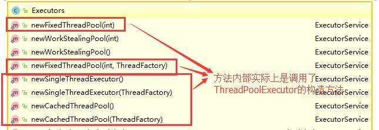

### 4.10.5 ThreadPoolExecutor 类分析

`ThreadPoolExecutor` 类中提供的四个构造方法。我们来看最长的那个，其余三个都是在这个构造方法的基础上产生（其他几个构造方法说白点都是给定某些默认参数的构造方法比如默认制定拒绝策略是什么），这里就不贴代码讲了，比较简单。

```java
/**
 * 用给定的初始参数创建一个新的ThreadPoolExecutor。
 */
public ThreadPoolExecutor(int corePoolSize,
                      int maximumPoolSize,
                      long keepAliveTime,
                      TimeUnit unit,
                      BlockingQueue<Runnable> workQueue,
                      ThreadFactory threadFactory,
                      RejectedExecutionHandler handler) {
    if (corePoolSize < 0 ||
        maximumPoolSize <= 0 ||
        maximumPoolSize < corePoolSize ||
        keepAliveTime < 0)
            throw new IllegalArgumentException();
    if (workQueue == null || threadFactory == null || handler == null)
        throw new NullPointerException();
    this.corePoolSize = corePoolSize;
    this.maximumPoolSize = maximumPoolSize;
    this.workQueue = workQueue;
    this.keepAliveTime = unit.toNanos(keepAliveTime);
    this.threadFactory = threadFactory;
    this.handler = handler;
}
```

### 4.10.6 `ThreadPoolExecutor`构造函数重要参数分析

**`ThreadPoolExecutor` 3 个最重要的参数：**

- **`corePoolSize` :** 核心线程数线程数定义了最小可以同时运行的线程数量。
- **`maximumPoolSize` :** 当队列中存放的任务达到队列容量的时候，当前可以同时运行的线程数量变为最大线程数。
- **`workQueue`:** 当新任务来的时候会先判断当前运行的线程数量是否达到核心线程数，如果达到的话，新任务就会被存放在队列中。

`ThreadPoolExecutor`其他常见参数:

1. **`keepAliveTime`**:当线程池中的线程数量大于 `corePoolSize` 的时候，如果这时没有新的任务提交，核心线程外的线程不会立即销毁，而是会等待，直到等待的时间超过了 `keepAliveTime`才会被回收销毁；
2. **`unit`** : `keepAliveTime` 参数的时间单位。
3. **`threadFactory`** :executor 创建新线程的时候会用到。
4. **`handler`** :饱和策略。关于饱和策略下面单独介绍一下。

### 4.10.7 `ThreadPoolExecutor` 饱和策略

**`ThreadPoolExecutor` 饱和策略定义:**

如果当前同时运行的线程数量达到最大线程数量并且队列也已经被放满了任务时，`ThreadPoolTaskExecutor` 定义一些策略:

- **`ThreadPoolExecutor.AbortPolicy`：** 抛出 `RejectedExecutionException`来拒绝新任务的处理。
- **`ThreadPoolExecutor.CallerRunsPolicy`：** 调用执行自己的线程运行任务，也就是直接在调用`execute`方法的线程中运行(`run`)被拒绝的任务，如果执行程序已关闭，则会丢弃该任务。因此这种策略会降低对于新任务提交速度，影响程序的整体性能。如果您的应用程序可以承受此延迟并且你要求任何一个任务请求都要被执行的话，你可以选择这个策略。
- **`ThreadPoolExecutor.DiscardPolicy`：** 不处理新任务，直接丢弃掉。
- **`ThreadPoolExecutor.DiscardOldestPolicy`：** 此策略将丢弃最早的未处理的任务请求。

举个例子： Spring 通过 `ThreadPoolTaskExecutor` 或者我们直接通过 `ThreadPoolExecutor` 的构造函数创建线程池的时候，当我们不指定 `RejectedExecutionHandler` 饱和策略的话来配置线程池的时候默认使用的是 `ThreadPoolExecutor.AbortPolicy`。在默认情况下，`ThreadPoolExecutor` 将抛出 `RejectedExecutionException` 来拒绝新来的任务 ，这代表你将丢失对这个任务的处理。 对于可伸缩的应用程序，建议使用 `ThreadPoolExecutor.CallerRunsPolicy`。当最大池被填满时，此策略为我们提供可伸缩队列。（这个直接查看 `ThreadPoolExecutor` 的构造函数源码就可以看出，比较简单的原因，这里就不贴代码了）

### 4.10.8 简单的线程池Demo

```java
// MyRunnable.java
import java.util.Date;

/**
 * 这是一个简单的Runnable类，需要大约5秒钟来执行其任务。
 * @author shuang.kou
 */
public class MyRunnable implements Runnable {

    private String command;

    public MyRunnable(String s) {
        this.command = s;
    }

    @Override
    public void run() {
        System.out.println(Thread.currentThread().getName() + " Start. Time = " + new Date());
        processCommand();
        System.out.println(Thread.currentThread().getName() + " End. Time = " + new Date());
    }

    private void processCommand() {
        try {
            Thread.sleep(5000);
        } catch (InterruptedException e) {
            e.printStackTrace();
        }
    }

    @Override
    public String toString() {
        return this.command;
    }
}
```

编写测试程序，我们这里以阿里巴巴推荐的使用 `ThreadPoolExecutor` 构造函数自定义参数的方式来创建线程池。

```java
// ThreadPoolExecutorDemo.java
import java.util.concurrent.ArrayBlockingQueue;
import java.util.concurrent.ThreadPoolExecutor;
import java.util.concurrent.TimeUnit;

public class ThreadPoolExecutorDemo {

    private static final int CORE_POOL_SIZE = 5;
    private static final int MAX_POOL_SIZE = 10;
    private static final int QUEUE_CAPACITY = 100;
    private static final Long KEEP_ALIVE_TIME = 1L;
    public static void main(String[] args) {

        //使用阿里巴巴推荐的创建线程池的方式
        //通过ThreadPoolExecutor构造函数自定义参数创建
        ThreadPoolExecutor executor = new ThreadPoolExecutor(
                CORE_POOL_SIZE,
                MAX_POOL_SIZE,
                KEEP_ALIVE_TIME,
                TimeUnit.SECONDS,
                new ArrayBlockingQueue<>(QUEUE_CAPACITY),
                new ThreadPoolExecutor.CallerRunsPolicy());

        for (int i = 0; i < 10; i++) {
            //创建WorkerThread对象（WorkerThread类实现了Runnable 接口）
            Runnable worker = new MyRunnable("" + i);
            //执行Runnable
            executor.execute(worker);
        }
        //终止线程池
        executor.shutdown();
        while (!executor.isTerminated()) {
        }
        System.out.println("Finished all threads");
    }
}
```

可以看到我们上面的代码指定了：

1. `corePoolSize`: 核心线程数为 5。
2. `maximumPoolSize` ：最大线程数 10
3. `keepAliveTime` : 等待时间为 1L。
4. `unit`: 等待时间的单位为 TimeUnit.SECONDS。
5. `workQueue`：任务队列为 `ArrayBlockingQueue`，并且容量为 100;
6. `handler`:饱和策略为 `CallerRunsPolicy`。

**Output：**

```java
pool-1-thread-3 Start. Time = Sun Apr 12 11:14:37 CST 2020
pool-1-thread-5 Start. Time = Sun Apr 12 11:14:37 CST 2020
pool-1-thread-2 Start. Time = Sun Apr 12 11:14:37 CST 2020
pool-1-thread-1 Start. Time = Sun Apr 12 11:14:37 CST 2020
pool-1-thread-4 Start. Time = Sun Apr 12 11:14:37 CST 2020
pool-1-thread-3 End. Time = Sun Apr 12 11:14:42 CST 2020
pool-1-thread-4 End. Time = Sun Apr 12 11:14:42 CST 2020
pool-1-thread-1 End. Time = Sun Apr 12 11:14:42 CST 2020
pool-1-thread-5 End. Time = Sun Apr 12 11:14:42 CST 2020
pool-1-thread-1 Start. Time = Sun Apr 12 11:14:42 CST 2020
pool-1-thread-2 End. Time = Sun Apr 12 11:14:42 CST 2020
pool-1-thread-5 Start. Time = Sun Apr 12 11:14:42 CST 2020
pool-1-thread-4 Start. Time = Sun Apr 12 11:14:42 CST 2020
pool-1-thread-3 Start. Time = Sun Apr 12 11:14:42 CST 2020
pool-1-thread-2 Start. Time = Sun Apr 12 11:14:42 CST 2020
pool-1-thread-1 End. Time = Sun Apr 12 11:14:47 CST 2020
pool-1-thread-4 End. Time = Sun Apr 12 11:14:47 CST 2020
pool-1-thread-5 End. Time = Sun Apr 12 11:14:47 CST 2020
pool-1-thread-3 End. Time = Sun Apr 12 11:14:47 CST 2020
pool-1-thread-2 End. Time = Sun Apr 12 11:14:47 CST 2020
```

### 4.10.9 线程池原理分析

我们通过代码输出结果可以看出：**线程池首先会先执行 5 个任务，然后这些任务有任务被执行完的话，就会去拿新的任务执行。** 大家可以先通过上面讲解的内容，分析一下到底是咋回事？（自己独立思考一会）

现在，我们就分析上面的输出内容来简单分析一下线程池原理。

**为了搞懂线程池的原理，我们需要首先分析一下 `execute`方法。** 在 4.6 节中的 Demo 中我们使用 `executor.execute(worker)`来提交一个任务到线程池中去，这个方法非常重要，下面我们来看看它的源码

```java
// 存放线程池的运行状态 (runState) 和线程池内有效线程的数量 (workerCount)
private final AtomicInteger ctl = new AtomicInteger(ctlOf(RUNNING, 0));

private static int workerCountOf(int c) {
    return c & CAPACITY;
}

private final BlockingQueue<Runnable> workQueue;

public void execute(Runnable command) {
    // 如果任务为null，则抛出异常。
    if (command == null)
        throw new NullPointerException();
    // ctl 中保存的线程池当前的一些状态信息
    int c = ctl.get();

    //  下面会涉及到 3 步 操作
    // 1.首先判断当前线程池中执行的任务数量是否小于 corePoolSize
    // 如果小于的话，通过addWorker(command, true)新建一个线程，并将任务(command)添加到该线程中；然后，启动该线程从而执行任务。
    if (workerCountOf(c) < corePoolSize) {
        if (addWorker(command, true))
            return;
        c = ctl.get();
    }
    // 2.如果当前执行的任务数量大于等于 corePoolSize 的时候就会走到这里
    // 通过 isRunning 方法判断线程池状态，线程池处于 RUNNING 状态才会被并且队列可以加入任务，该任务才会被加入进去
    if (isRunning(c) && workQueue.offer(command)) {
        int recheck = ctl.get();
        // 再次获取线程池状态，如果线程池状态不是 RUNNING 状态就需要从任务队列中移除任务，并尝试判断线程是否全部执行完毕。同时执行拒绝策略。
        if (!isRunning(recheck) && remove(command))
            reject(command);
            // 如果当前线程池为空就新创建一个线程并执行。
        else if (workerCountOf(recheck) == 0)
            addWorker(null, false);
    }
    //3. 通过addWorker(command, false)新建一个线程，并将任务(command)添加到该线程中；然后，启动该线程从而执行任务。
    //如果addWorker(command, false)执行失败，则通过reject()执行相应的拒绝策略的内容。
    else if (!addWorker(command, false))
        reject(command);
}
```

通过下图可以更好的对上面这 3 步做一个展示，下图是我为了省事直接从网上找到，原地址不明。


现在，让我们在回到 4.6 节我们写的 Demo， 现在应该是不是很容易就可以搞懂它的原理了呢？

没搞懂的话，也没关系，可以看看我的分析：

> 我们在代码中模拟了 10 个任务，我们配置的核心线程数为 5 、等待队列容量为 100 ，所以每次只可能存在 5 个任务同时执行，剩下的 5 个任务会被放到等待队列中去。当前的5个任务中如果有任务被执行完了，线程池就会去拿新的任务执行。

### 4.10.10 知道哪些线程池有哪些？

### 4.10.11 线程池的七大参数

### 4.10.12 线程池中的线程工厂是干什么用的

## 4.11 Java 原子类

### 4.11.1 原子类是什么？

`Atomic` 翻译成中文是原子的意思。在化学上，我们知道原子是构成一般物质的最小单位，在化学反应中是不可分割的。在我们这里 Atomic 是指一个操作是不可中断的。即使是在多个线程一起执行的时候，一个操作一旦开始，就不会被其他线程干扰。

### 4.11.2原子类包含四种基本的类型：

**基本类型**：使用原子的方式更新基本类型  

- `AtomicInteger`：整形原子类 
- `AtomicLong`：长整型原子类 
- `AtomicBoolean`：布尔型原子类 

**数组类型**：使用原子的方式更新数组里的某个元素  

- `AtomicIntegerArray`：整形数组原子类 
- `AtomicLongArray`：长整形数组原子类 
- `AtomicReferenceArray`：引用类型数组原子类 

**引用类型**：  

- `AtomicReference`：引用类型原子类，存在ABA问题 
- `AtomicStampedReference`：原子更新带有版本号的引用类型。该类将整数值与引用关联起来，可用于原子的更新数据和数据的版本号，可以解决使用CAS进行原子更新时可能出现的ABA问题。 
- `AtomicMarkableReference`：原子更新带有标记位的引用类型 

**原子更新字段类**

- `AtomicIntegerFieldUpdate`r：原子更新整型的字段的更新器。 
- `AtomicLongFieldUpdater`：原子更新长整型字段的更新器。 
- `AtomicReferenceFieldUpdater`：引用类型更新器原子类

### 4.11.3 AtomicInteger 类的原理

AtomicInteger 类主要利用 CAS (compare and swap) + volatile 和 native 方法来保证原子操作，从而避免 synchronized 的高开销，执行效率大为提升。

CAS 的原理是拿期望的值和原本的一个值作比较，如果相同则更新成新的值。UnSafe 类的 objectFieldOffset() 方法是一个本地方法，这个方法是用来拿到“原来的值”的内存地址，返回值是 valueOffset。另外 value 是一个 volatile 变量，在内存中可见，因此 JVM 可以保证任何时刻任何线程总能拿到该变量的最新值。

## 4.12 AQS

### 4.12.1 什么是AQS?

AQS 的全称为（`AbstractQueuedSynchronizer`）抽象队列同步器，这个类在`java.util.concurrent.locks`包下面。

AQS 是一个用来构建锁和同步器的框架，使用 AQS 能简单且高效地构造出应用广泛的大量的同步器，比如我们提到的 `ReentrantLock`，`Semaphore`，其他的诸如 `ReentrantReadWriteLock`，`SynchronousQueue`，`FutureTask` 等等皆是基于 AQS 的。当然，我们自己也能利用 AQS 非常轻松容易地构造出符合我们自己需求的同步器。

### 4.12.2 AQS 原理分析

**AQS 核心思想是，如果被请求的共享资源空闲，则将当前请求资源的线程设置为有效的工作线程，并且将共享资源设置为锁定状态。如果被请求的共享资源被占用，那么就需要一套线程阻塞等待以及被唤醒时锁分配的机制，这个机制 AQS 是用 CLH 队列锁实现的，即将暂时获取不到锁的线程加入到队列中。**

> CLH(Craig,Landin,and Hagersten)队列是一个虚拟的双向队列（虚拟的双向队列即不存在队列实例，仅存在结点之间的关联关系）。AQS 是将每条请求共享资源的线程封装成一个 CLH 锁队列的一个结点（Node）来实现锁的分配。


AQS 使用一个 int 成员变量来表示同步状态，通过内置的 FIFO 队列来完成获取资源线程的排队工作。AQS 使用 CAS 对该同步状态进行原子操作实现对其值的修改。

> AQS 使用一个 int 成员变量来表示同步状态，通过内置的 FIFO 队列来完成获取资源线程的排队工作。AQS 使用 CAS 对该同步状态进行原子操作实现对其值的修改。

状态信息通过 protected 类型的 getState，setState，compareAndSetState 进行操作

```java
//返回同步状态的当前值
protected final int getState() {
    return state;
}
//设置同步状态的值
protected final void setState(int newState) {
    state = newState;
}
//原子地（CAS操作）将同步状态值设置为给定值update如果当前同步状态的值等于expect（期望值）
protected final boolean compareAndSetState(int expect, int update) {
    return unsafe.compareAndSwapInt(this, stateOffset, expect, update);
}
```

### 4.12.3 AQS 对资源的共享方式

**AQS 定义两种资源共享方式**

- Exclusive

  （独占）：只有一个线程能执行，如 `ReentrantLock`（重入锁）。又可分为公平锁和非公平锁：

  - 公平锁：按照线程在队列中的排队顺序，先到者先拿到锁
  - 非公平锁：当线程要获取锁时，无视队列顺序直接去抢锁，谁抢到就是谁的

- **Share**（共享）：多个线程可同时执行，如` CountDownLatch`、`Semaphore`、 `CyclicBarrier`、`ReadWriteLock` 我们都会在后面讲到。

`ReentrantReadWriteLock` (可重入读写锁）可以看成是组合式，因为 `ReentrantReadWriteLock` 也就是读写锁允许多个线程同时对某一资源进行读。

不同的自定义同步器争用共享资源的方式也不同。自定义同步器在实现时只需要实现共享资源 state 的获取与释放方式即可，至于具体线程等待队列的维护（如获取资源失败入队/唤醒出队等），AQS 已经在顶层实现好了。

###  4.12.4. AQS 底层使用了模板方法模式

同步器的设计是基于模板方法模式的，如果需要自定义同步器一般的方式是这样（模板方法模式很经典的一个应用）：

1. 使用者继承 `AbstractQueuedSynchronizer` 并重写指定的方法。（这些重写方法很简单，无非是对于共享资源 state 的获取和释放）
2. 将 AQS 组合在自定义同步组件的实现中，并调用其模板方法，而这些模板方法会调用使用者重写的方法。

这和我们以往通过实现接口的方式有很大区别，这是模板方法模式很经典的一个运用。

**AQS 使用了模板方法模式，自定义同步器时需要重写下面几个 AQS 提供的模板方法：**

```java
isHeldExclusively()//该线程是否正在独占资源。只有用到condition才需要去实现它。
tryAcquire(int)//独占方式。尝试获取资源，成功则返回true，失败则返回false。
tryRelease(int)//独占方式。尝试释放资源，成功则返回true，失败则返回false。
tryAcquireShared(int)//共享方式。尝试获取资源。负数表示失败；0表示成功，但没有剩余可用资源；正数表示成功，且有剩余资源。
tryReleaseShared(int)//共享方式。尝试释放资源，成功则返回true，失败则返回false。
```

默认情况下，每个方法都抛出 `UnsupportedOperationException`。 这些方法的实现必须是内部线程安全的，并且通常应该简短而不是阻塞。AQS 类中的其他方法都是 final ，所以无法被其他类使用，只有这几个方法可以被其他类使用。

以 ReentrantLock 为例，state 初始化为 0，表示未锁定状态。A 线程 lock()时，会调用 tryAcquire()独占该锁并将 state+1。此后，其他线程再 tryAcquire()时就会失败，直到 A 线程 unlock()到 state=0（即释放锁）为止，其它线程才有机会获取该锁。当然，释放锁之前，A 线程自己是可以重复获取此锁的（state 会累加），这就是可重入的概念。但要注意，获取多少次就要释放多少次，这样才能保证 state 是能回到零态的。

再以 `CountDownLatch` 以例，任务分为 N 个子线程去执行，state 也初始化为 N（注意 N 要与线程个数一致）。这 N 个子线程是并行执行的，每个子线程执行完后` countDown()` 一次，state 会 CAS(Compare and Swap)减 1。等到所有子线程都执行完后(即 state=0)，会 unpark()主调用线程，然后主调用线程就会从 `await()` 函数返回，继续后余动作。

一般来说，自定义同步器要么是独占方法，要么是共享方式，他们也只需实现`tryAcquire-tryRelease`、`tryAcquireShared-tryReleaseShared`中的一种即可。但 AQS 也支持自定义同步器同时实现独占和共享两种方式，如`ReentrantReadWriteLock`。

### 4.12.5 AQS 组件总结

- **`Semaphore`(信号量)-允许多个线程同时访问：** `synchronized` 和 `ReentrantLock` 都是一次只允许一个线程访问某个资源，`Semaphore`(信号量)可以指定多个线程同时访问某个资源。
- **`CountDownLatch `（倒计时器）：** `CountDownLatch` 是一个同步工具类，用来协调多个线程之间的同步。这个工具通常用来控制线程等待，它可以让某一个线程等待直到倒计时结束，再开始执行。
- **`CyclicBarrier`(循环栅栏)：** `CyclicBarrier` 和 `CountDownLatch` 非常类似，它也可以实现线程间的技术等待，但是它的功能比 `CountDownLatch` 更加复杂和强大。主要应用场景和 `CountDownLatch` 类似。`CyclicBarrier` 的字面意思是可循环使用（`Cyclic`）的屏障（`Barrier`）。它要做的事情是，让一组线程到达一个屏障（也可以叫同步点）时被阻塞，直到最后一个线程到达屏障时，屏障才会开门，所有被屏障拦截的线程才会继续干活。`CyclicBarrier` 默认的构造方法是 `CyclicBarrier(int parties)`，其参数表示屏障拦截的线程数量，每个线程调用 `await()` 方法告诉 `CyclicBarrier` 我已经到达了屏障，然后当前线程被阻塞。

### 4.12.6 用过 CountDownLatch 么？什么场景下用的？

`CountDownLatch` 的作用就是 允许 count 个线程阻塞在一个地方，直至所有线程的任务都执行完毕。之前在项目中，有一个使用多线程读取多个文件处理的场景，我用到了 `CountDownLatch` 。具体场景是下面这样的：

我们要读取处理 6 个文件，这 6 个任务都是没有执行顺序依赖的任务，但是我们需要返回给用户的时候将这几个文件的处理的结果进行统计整理。

为此我们定义了一个线程池和 count 为 6 的`CountDownLatch`对象 。使用线程池处理读取任务，每一个线程处理完之后就将 count-1，调用`CountDownLatch`对象的 `await()`方法，直到所有文件读取完之后，才会接着执行后面的逻辑。

```java
public class CountDownLatchExample1 {
    // 处理文件的数量
    private static final int threadCount = 6;

    public static void main(String[] args) throws InterruptedException {
        // 创建一个具有固定线程数量的线程池对象（推荐使用构造方法创建）
        ExecutorService threadPool = Executors.newFixedThreadPool(10);
        final CountDownLatch countDownLatch = new CountDownLatch(threadCount);
        for (int i = 0; i < threadCount; i++) {
            final int threadnum = i;
            threadPool.execute(() -> {
                try {
                    //处理文件的业务操作
                    //......
                } catch (InterruptedException e) {
                    e.printStackTrace();
                } finally {
                    //表示一个文件已经被完成
                    countDownLatch.countDown();
                }

            });
        }
        countDownLatch.await();
        threadPool.shutdown();
        System.out.println("finish");
    }
}
```

**有没有可以改进的地方呢？**

可以使用 `CompletableFuture` 类来改进！Java8 的 `CompletableFuture` 提供了很多对多线程友好的方法，使用它可以很方便地为我们编写多线程程序，什么异步、串行、并行或者等待所有线程执行完任务什么的都非常方便。

```java
CompletableFuture<Void> task1 =
    CompletableFuture.supplyAsync(()->{
        //自定义业务操作
    });
......
CompletableFuture<Void> task6 =
    CompletableFuture.supplyAsync(()->{
    //自定义业务操作
    });
......
CompletableFuture<Void> headerFuture=CompletableFuture.allOf(task1,.....,task6);

try {
    headerFuture.join();
} catch (Exception ex) {
    //......
}
System.out.println("all done. ");
```

上面的代码还可以接续优化，当任务过多的时候，把每一个 task 都列出来不太现实，可以考虑通过循环来添加任务。

```java
//文件夹位置
List<String> filePaths = Arrays.asList(...)
// 异步处理所有文件
List<CompletableFuture<String>> fileFutures = filePaths.stream()
    .map(filePath -> doSomeThing(filePath))
    .collect(Collectors.toList());
// 将他们合并起来
CompletableFuture<Void> allFutures = CompletableFuture.allOf(
    fileFutures.toArray(new CompletableFuture[fileFutures.size()])
);
```

## 

## 4.13 Java 反射 类加载器

### 4.13.1  什么是类加载器？

通过一个类的全限定名来获取描述此类的二进制字节流这个动作放到Java虚拟机外部去实现，以便让应用程序自己决定如何去获取所需要的类。实现这个动作的代码模块称为**“类加载器”**。

### 4.13.2 类加载器有哪些？


- **BootstrapClassLoader**：启动类类加载器，它用来加载<JAVA_HOME>/jre/lib路径,**-**Xbootclasspath参数指定的路径以<JAVA_HOME>/jre/classes中的类。BootStrapClassLoader是由c++实现的。
- **ExtClassLoader**：拓展类类加载器，它用来加载<JAVA_HOME>/jre/lib/ext路径以及java.ext.dirs系统变量指定的类路径下的类。
- **AppClassLoader**：应用程序类类加载器，它主要加载应用程序ClassPath下的类（包含jar包中的类）。它是java应用程序默认的类加载器。
- **用户自定义类加载器**：用户根据自定义需求，自由的定制加载的逻辑，继承AppClassLoader，仅仅覆盖findClass（）即将继续遵守双亲委派模型。
- ***ThreadContextClassLoader**：线程上下文加载器，它不是一个新的类型，更像一个类加载器的角色，ThreadContextClassLoader可以是上述类加载器的任意一种，但往往是AppClassLoader，作用我们后面再说。

在虚拟机启动的时候会初始化BootstrapClassLoader，然后在Launcher类中去加载ExtClassLoader、AppClassLoader，并将AppClassLoader的parent设置为ExtClassLoader，并设置线程上下文类加载器。


# 5. 中间件

## 5.1 Spring

## 5.2 SpringBoot

## 5.3 Maven

## 5.4 Mybatis

## 5.5 Redis

### 5.5.1 Redis 简介

简单来说 **Redis 就是一个使用 C 语言开发的数据库**，不过与传统数据库不同的是 **Redis 的数据是存在内存中的** ，也就是它是内存数据库，所以读写速度非常快，因此 Redis 被广泛应用于缓存方向。

另外，**Redis 除了做缓存之外，也经常用来做分布式锁，甚至是消息队列。**

**Redis 提供了多种数据类型来支持不同的业务场景。Redis 还支持事务 、持久化、Lua 脚本、多种集群方案。**

###  5.5.2 分布式缓存常见的技术选型方案有哪些？

分布式缓存的话，使用的比较多的主要是 **Memcached** 和 **Redis**。不过，现在基本没有看过还有项目使用 **Memcached** 来做缓存，都是直接用 **Redis**。

Memcached 是分布式缓存最开始兴起的那会，比较常用的。后来，随着 Redis 的发展，大家慢慢都转而使用更加强大的 Redis 了。

分布式缓存主要解决的是单机缓存的容量受服务器限制并且无法保存通用信息的问题。因为，本地缓存只在当前服务里有效，比如如果你部署了两个相同的服务，他们两者之间的缓存数据是无法共同的。

> 自己注：分布式缓存两大特点：1. 可以突破单台机器的限制。2. 解决多台设备缓存无法交流的问题。

### 5.5.3  说一下 Redis 和 Memcached 的区别和共同点

现在公司一般都是用 Redis 来实现缓存，而且 Redis 自身也越来越强大了！不过，了解 Redis 和 Memcached 的区别和共同点，有助于我们在做相应的技术选型的时候，能够做到有理有据！

**共同点** ：

1. 都是基于内存的数据库，一般都用来当做缓存使用。
2. 都有过期策略。
3. 两者的性能都非常高。

**区别** ：

1. **Redis 支持更丰富的数据类型（支持更复杂的应用场景）**。Redis 不仅仅支持简单的 k/v 类型的数据，同时还提供 list，set，zset，hash 等数据结构的存储。Memcached 只支持最简单的 k/v 数据类型。
2. **Redis 支持数据的持久化，可以将内存中的数据保持在磁盘中，重启的时候可以再次加载进行使用,而 Memecache 把数据全部存在内存之中。**
3. **Redis 有灾难恢复机制。** 因为可以把缓存中的数据持久化到磁盘上。
4. **Redis 在服务器内存使用完之后，可以将不用的数据放到磁盘上。但是，Memcached 在服务器内存使用完之后，就会直接报异常。**
5. **Memcached 没有原生的集群模式，需要依靠客户端来实现往集群中分片写入数据；但是 Redis 目前是原生支持 cluster 模式的。**
6. **Memcached 是多线程，非阻塞 IO 复用的网络模型；Redis 使用单线程的多路 IO 复用模型。** （Redis 6.0 引入了多线程 IO ）
7. **Redis 支持发布订阅模型、Lua 脚本、事务等功能，而 Memcached 不支持。并且，Redis 支持更多的编程语言。**
8. **Memcached 过期数据的删除策略只用了惰性删除，而 Redis 同时使用了惰性删除与定期删除。**

相信看了上面的对比之后，我们已经没有什么理由可以选择使用 Memcached 来作为自己项目的分布式缓存了。

> 主要是更多的了解Redis的特点。

### 5.5.4 Redis 工作过程


简单来说就是:

1. 如果用户请求的数据在缓存中就直接返回。
2. 缓存中不存在的话就看数据库中是否存在。
3. 数据库中存在的话就更新缓存中的数据。
4. 数据库中不存在的话就返回空数据。

###  5.5.5 为什么要用 Redis/为什么要用缓存？

*简单，来说使用缓存主要是为了提升用户体验以及应对更多的用户。*

下面我们主要从“高性能”和“高并发”这两点来看待这个问题。


**高性能** ：

对照上面 👆 我画的图。我们设想这样的场景：

假如用户第一次访问数据库中的某些数据的话，这个过程是比较慢，毕竟是从硬盘中读取的。但是，如果说，用户访问的数据属于高频数据并且不会经常改变的话，那么我们就可以很放心地将该用户访问的数据存在缓存中。

**这样有什么好处呢？** 那就是保证用户下一次再访问这些数据的时候就可以直接从缓存中获取了。操作缓存就是直接操作内存，所以速度相当快。

不过，要保持数据库和缓存中的数据的一致性。 如果数据库中的对应数据改变的之后，同步改变缓存中相应的数据即可！

**高并发：**

一般像 MySQL 这类的数据库的 QPS 大概都在 1w 左右（4 核 8g） ，但是使用 Redis 缓存之后很容易达到 10w+，甚至最高能达到 30w+（就单机 redis 的情况，redis 集群的话会更高）。

> QPS（Query Per Second）：服务器每秒可以执行的查询次数；

由此可见，直接操作缓存能够承受的数据库请求数量是远远大于直接访问数据库的，所以我们可以考虑把数据库中的部分数据转移到缓存中去，这样用户的一部分请求会直接到缓存这里而不用经过数据库。进而，我们也就提高了系统整体的并发。

### 5.5.6 Redis 除了可以做数据库还可以做什么？

- **分布式锁** ： 通过 Redis 来做分布式锁是一种比较常见的方式。通常情况下，我们都是基于 Redisson 来实现分布式锁。相关阅读：[《分布式锁中的王者方案 - Redisson》](https://mp.weixin.qq.com/s/CbnPRfvq4m1sqo2uKI6qQw)。
- **限流** ：一般是通过 Redis + Lua 脚本的方式来实现限流。相关阅读：[《我司用了 6 年的 Redis 分布式限流器，可以说是非常厉害了！》](https://mp.weixin.qq.com/s/kyFAWH3mVNJvurQDt4vchA)。
- **消息队列** ：Redis 自带的 list 数据结构可以作为一个简单的队列使用。Redis5.0 中增加的 Stream 类型的数据结构更加适合用来做消息队列。它比较类似于 Kafka，有主题和消费组的概念，支持消息持久化以及 ACK 机制。
- **复杂业务场景** ：通过 Redis 以及 Redis 扩展（比如 Redisson）提供的数据结构，我们可以很方便地完成很多复杂的业务场景比如通过 bitmap 统计活跃用户、通过 sorted set 维护排行榜。
- ......

### 5.5.7 Redis 常见数据结构以及使用场景分析

**你可以自己本机安装 redis 或者通过 redis 官网提供的[在线 redis 环境](https://try.redis.io/)。**

####  string

1. **介绍** ：string 数据结构是简单的 key-value 类型。虽然 Redis 是用 C 语言写的，但是 Redis 并没有使用 C 的字符串表示，而是自己构建了一种 **简单动态字符串**（simple dynamic string，**SDS**）。相比于 C 的原生字符串，Redis 的 SDS 不光可以保存文本数据还可以保存二进制数据，并且获取字符串长度复杂度为 O(1)（C 字符串为 O(N)）,除此之外，Redis 的 SDS API 是安全的，不会造成缓冲区溢出。
2. **常用命令：** `set,get,strlen,exists,decr,incr,setex` 等等。
3. **应用场景：** 一般常用在需要计数的场景，比如用户的访问次数、热点文章的点赞转发数量等等。

下面我们简单看看它的使用！

**普通字符串的基本操作：**

```
127.0.0.1:6379> set key value #设置 key-value 类型的值
OK
127.0.0.1:6379> get key # 根据 key 获得对应的 value
"value"
127.0.0.1:6379> exists key  # 判断某个 key 是否存在
(integer) 1
127.0.0.1:6379> strlen key # 返回 key 所储存的字符串值的长度。
(integer) 5
127.0.0.1:6379> del key # 删除某个 key 对应的值
(integer) 1
127.0.0.1:6379> get key
(nil)
```

**批量设置** :

```
127.0.0.1:6379> mset key1 value1 key2 value2 # 批量设置 key-value 类型的值
OK
127.0.0.1:6379> mget key1 key2 # 批量获取多个 key 对应的 value
1) "value1"
2) "value2"
```

**计数器（字符串的内容为整数的时候可以使用）：**

```
127.0.0.1:6379> set number 1
OK
127.0.0.1:6379> incr number # 将 key 中储存的数字值增一
(integer) 2
127.0.0.1:6379> get number
"2"
127.0.0.1:6379> decr number # 将 key 中储存的数字值减一
(integer) 1
127.0.0.1:6379> get number
"1"
```

**过期（默认为永不过期）**：

```
127.0.0.1:6379> expire key  60 # 数据在 60s 后过期
(integer) 1
127.0.0.1:6379> setex key 60 value # 数据在 60s 后过期 (setex:[set] + [ex]pire)
OK
127.0.0.1:6379> ttl key # 查看数据还有多久过期
(integer) 56
```

####  list

1. **介绍** ：**list** 即是 **链表**。链表是一种非常常见的数据结构，特点是易于数据元素的插入和删除并且可以灵活调整链表长度，但是链表的随机访问困难。许多高级编程语言都内置了链表的实现比如 Java 中的 **LinkedList**，但是 C 语言并没有实现链表，所以 Redis 实现了自己的链表数据结构。Redis 的 list 的实现为一个 **双向链表**，即可以支持反向查找和遍历，更方便操作，不过带来了部分额外的内存开销。
2. **常用命令:** `rpush,lpop,lpush,rpop,lrange,llen` 等。
3. **应用场景:** 发布与订阅或者说消息队列、慢查询。

下面我们简单看看它的使用！

**通过 `rpush/lpop` 实现队列：**

```
127.0.0.1:6379> rpush myList value1 # 向 list 的头部（右边）添加元素
(integer) 1
127.0.0.1:6379> rpush myList value2 value3 # 向list的头部（最右边）添加多个元素
(integer) 3
127.0.0.1:6379> lpop myList # 将 list的尾部(最左边)元素取出
"value1"
127.0.0.1:6379> lrange myList 0 1 # 查看对应下标的list列表， 0 为 start,1为 end
1) "value2"
2) "value3"
127.0.0.1:6379> lrange myList 0 -1 # 查看列表中的所有元素，-1表示倒数第一
1) "value2"
2) "value3"
```

**通过 `rpush/rpop` 实现栈：**

```
127.0.0.1:6379> rpush myList2 value1 value2 value3
(integer) 3
127.0.0.1:6379> rpop myList2 # 将 list的头部(最右边)元素取出
"value3"
```

我专门花了一个图方便小伙伴们来理解：


**通过 `lrange` 查看对应下标范围的列表元素：**

```
127.0.0.1:6379> rpush myList value1 value2 value3
(integer) 3
127.0.0.1:6379> lrange myList 0 1 # 查看对应下标的list列表， 0 为 start,1为 end
1) "value1"
2) "value2"
127.0.0.1:6379> lrange myList 0 -1 # 查看列表中的所有元素，-1表示倒数第一
1) "value1"
2) "value2"
3) "value3"
```

通过 `lrange` 命令，你可以基于 list 实现分页查询，性能非常高！

**通过 `llen` 查看链表长度：**

```
127.0.0.1:6379> llen myList
(integer) 3
```

####  hash

1. **介绍** ：hash 类似于 JDK1.8 前的 HashMap，内部实现也差不多(数组 + 链表)。不过，Redis 的 hash 做了更多优化。另外，hash 是一个 string 类型的 field 和 value 的映射表，**特别适合用于存储对象**，后续操作的时候，你可以直接仅仅修改这个对象中的某个字段的值。 比如我们可以 hash 数据结构来存储用户信息，商品信息等等。
2. **常用命令：** `hset,hmset,hexists,hget,hgetall,hkeys,hvals` 等。
3. **应用场景:** 系统中对象数据的存储。

下面我们简单看看它的使用！

```
127.0.0.1:6379> hmset userInfoKey name "guide" description "dev" age "24"
OK
127.0.0.1:6379> hexists userInfoKey name # 查看 key 对应的 value中指定的字段是否存在。
(integer) 1
127.0.0.1:6379> hget userInfoKey name # 获取存储在哈希表中指定字段的值。
"guide"
127.0.0.1:6379> hget userInfoKey age
"24"
127.0.0.1:6379> hgetall userInfoKey # 获取在哈希表中指定 key 的所有字段和值
1) "name"
2) "guide"
3) "description"
4) "dev"
5) "age"
6) "24"
127.0.0.1:6379> hkeys userInfoKey # 获取 key 列表
1) "name"
2) "description"
3) "age"
127.0.0.1:6379> hvals userInfoKey # 获取 value 列表
1) "guide"
2) "dev"
3) "24"
127.0.0.1:6379> hset userInfoKey name "GuideGeGe" # 修改某个字段对应的值
127.0.0.1:6379> hget userInfoKey name
"GuideGeGe"
```

####  set

1. **介绍 ：** set 类似于 Java 中的 `HashSet` 。Redis 中的 set 类型是一种无序集合，集合中的元素没有先后顺序。当你需要存储一个列表数据，又不希望出现重复数据时，set 是一个很好的选择，并且 set 提供了判断某个成员是否在一个 set 集合内的重要接口，这个也是 list 所不能提供的。可以基于 set 轻易实现交集、并集、差集的操作。比如：你可以将一个用户所有的关注人存在一个集合中，将其所有粉丝存在一个集合。Redis 可以非常方便的实现如共同关注、共同粉丝、共同喜好等功能。这个过程也就是求交集的过程。
2. **常用命令：** `sadd,spop,smembers,sismember,scard,sinterstore,sunion` 等。
3. **应用场景:** 需要存放的数据不能重复以及需要获取多个数据源交集和并集等场景

下面我们简单看看它的使用！

```
127.0.0.1:6379> sadd mySet value1 value2 # 添加元素进去
(integer) 2
127.0.0.1:6379> sadd mySet value1 # 不允许有重复元素
(integer) 0
127.0.0.1:6379> smembers mySet # 查看 set 中所有的元素
1) "value1"
2) "value2"
127.0.0.1:6379> scard mySet # 查看 set 的长度
(integer) 2
127.0.0.1:6379> sismember mySet value1 # 检查某个元素是否存在set 中，只能接收单个元素
(integer) 1
127.0.0.1:6379> sadd mySet2 value2 value3
(integer) 2
127.0.0.1:6379> sinterstore mySet3 mySet mySet2 # 获取 mySet 和 mySet2 的交集并存放在 mySet3 中
(integer) 1
127.0.0.1:6379> smembers mySet3
1) "value2"
```

####  sorted set

1. **介绍：** 和 set 相比，sorted set 增加了一个权重参数 score，使得集合中的元素能够按 score 进行有序排列，还可以通过 score 的范围来获取元素的列表。有点像是 Java 中 HashMap 和 TreeSet 的结合体。
2. **常用命令：** `zadd,zcard,zscore,zrange,zrevrange,zrem` 等。
3. **应用场景：** 需要对数据根据某个权重进行排序的场景。比如在直播系统中，实时排行信息包含直播间在线用户列表，各种礼物排行榜，弹幕消息（可以理解为按消息维度的消息排行榜）等信息。

```
127.0.0.1:6379> zadd myZset 3.0 value1 # 添加元素到 sorted set 中 3.0 为权重
(integer) 1
127.0.0.1:6379> zadd myZset 2.0 value2 1.0 value3 # 一次添加多个元素
(integer) 2
127.0.0.1:6379> zcard myZset # 查看 sorted set 中的元素数量
(integer) 3
127.0.0.1:6379> zscore myZset value1 # 查看某个 value 的权重
"3"
127.0.0.1:6379> zrange  myZset 0 -1 # 顺序输出某个范围区间的元素，0 -1 表示输出所有元素
1) "value3"
2) "value2"
3) "value1"
127.0.0.1:6379> zrange  myZset 0 1 # 顺序输出某个范围区间的元素，0 为 start  1 为 stop
1) "value3"
2) "value2"
127.0.0.1:6379> zrevrange  myZset 0 1 # 逆序输出某个范围区间的元素，0 为 start  1 为 stop
1) "value1"
2) "value2"
```

####  bitmap

1. **介绍：** bitmap 存储的是连续的二进制数字（0 和 1），通过 bitmap, 只需要一个 bit 位来表示某个元素对应的值或者状态，key 就是对应元素本身 。我们知道 8 个 bit 可以组成一个 byte，所以 bitmap 本身会极大的节省储存空间。
2. **常用命令：** `setbit` 、`getbit` 、`bitcount`、`bitop`
3. **应用场景：** 适合需要保存状态信息（比如是否签到、是否登录...）并需要进一步对这些信息进行分析的场景。比如用户签到情况、活跃用户情况、用户行为统计（比如是否点赞过某个视频）。

```
# SETBIT 会返回之前位的值（默认是 0）这里会生成 7 个位
127.0.0.1:6379> setbit mykey 7 1
(integer) 0
127.0.0.1:6379> setbit mykey 7 0
(integer) 1
127.0.0.1:6379> getbit mykey 7
(integer) 0
127.0.0.1:6379> setbit mykey 6 1
(integer) 0
127.0.0.1:6379> setbit mykey 8 1
(integer) 0
# 通过 bitcount 统计被被设置为 1 的位的数量。
127.0.0.1:6379> bitcount mykey
(integer) 2
```

#### 使用场景说明

**使用场景一：用户行为分析** 很多网站为了分析你的喜好，需要研究你点赞过的内容。

```
# 记录你喜欢过 001 号小姐姐
127.0.0.1:6379> setbit beauty_girl_001 uid 1
```

**使用场景二：统计活跃用户**

使用时间作为 key，然后用户 ID 为 offset，如果当日活跃过就设置为 1

那么我该如何计算某几天/月/年的活跃用户呢(暂且约定，统计时间内只要有一天在线就称为活跃)，有请下一个 redis 的命令

```
# 对一个或多个保存二进制位的字符串 key 进行位元操作，并将结果保存到 destkey 上。
# BITOP 命令支持 AND 、 OR 、 NOT 、 XOR 这四种操作中的任意一种参数
BITOP operation destkey key [key ...]
```

初始化数据：

```
127.0.0.1:6379> setbit 20210308 1 1
(integer) 0
127.0.0.1:6379> setbit 20210308 2 1
(integer) 0
127.0.0.1:6379> setbit 20210309 1 1
(integer) 0
```

统计 20210308~20210309 总活跃用户数: 1

```
127.0.0.1:6379> bitop and desk1 20210308 20210309
(integer) 1
127.0.0.1:6379> bitcount desk1
(integer) 1
```

统计 20210308~20210309 在线活跃用户数: 2

```
127.0.0.1:6379> bitop or desk2 20210308 20210309
(integer) 1
127.0.0.1:6379> bitcount desk2
(integer) 2
```

**使用场景三：用户在线状态**

对于获取或者统计用户在线状态，使用 bitmap 是一个节约空间且效率又高的一种方法。

只需要一个 key，然后用户 ID 为 offset，如果在线就设置为 1，不在线就设置为 0。

### 5.5.8  Redis 单线程模型详解

**Redis 基于 Reactor 模式来设计开发了自己的一套高效的事件处理模型** （Netty 的线程模型也基于 Reactor 模式，Reactor 模式不愧是高性能 IO 的基石），这套事件处理模型对应的是 Redis 中的文件事件处理器（file event handler）。由于文件事件处理器（file event handler）是单线程方式运行的，所以我们一般都说 Redis 是单线程模型。

**既然是单线程，那怎么监听大量的客户端连接呢？**

Redis 通过**IO 多路复用程序** 来监听来自客户端的大量连接（或者说是监听多个 socket），它会将感兴趣的事件及类型（读、写）注册到内核中并监听每个事件是否发生。

这样的好处非常明显： **I/O 多路复用技术的使用让 Redis 不需要额外创建多余的线程来监听客户端的大量连接，降低了资源的消耗**（和 NIO 中的 `Selector` 组件很像）。

另外， Redis 服务器是一个事件驱动程序，服务器需要处理两类事件：1. 文件事件; 2. 时间事件。

时间事件不需要多花时间了解，我们接触最多的还是 **文件事件**（客户端进行读取写入等操作，涉及一系列网络通信）。

《Redis 设计与实现》有一段话是如是介绍文件事件的，我觉得写得挺不错。

> Redis 基于 Reactor 模式开发了自己的网络事件处理器：这个处理器被称为文件事件处理器（file event handler）。文件事件处理器使用 I/O 多路复用（multiplexing）程序来同时监听多个套接字，并根据套接字目前执行的任务来为套接字关联不同的事件处理器。
>
> 当被监听的套接字准备好执行连接应答（accept）、读取（read）、写入（write）、关 闭（close）等操作时，与操作相对应的文件事件就会产生，这时文件事件处理器就会调用套接字之前关联好的事件处理器来处理这些事件。
>
> **虽然文件事件处理器以单线程方式运行，但通过使用 I/O 多路复用程序来监听多个套接字**，文件事件处理器既实现了高性能的网络通信模型，又可以很好地与 Redis 服务器中其他同样以单线程方式运行的模块进行对接，这保持了 Redis 内部单线程设计的简单性。

可以看出，文件事件处理器（file event handler）主要是包含 4 个部分：

- 多个 socket（客户端连接）
- IO 多路复用程序（支持多个客户端连接的关键）
- 文件事件分派器（将 socket 关联到相应的事件处理器）
- 事件处理器（连接应答处理器、命令请求处理器、命令回复处理器）


### 5.5.9 Redis 没有使用多线程？为什么不使用多线程？

虽然说 Redis 是单线程模型，但是，实际上，**Redis 在 4.0 之后的版本中就已经加入了对多线程的支持。**

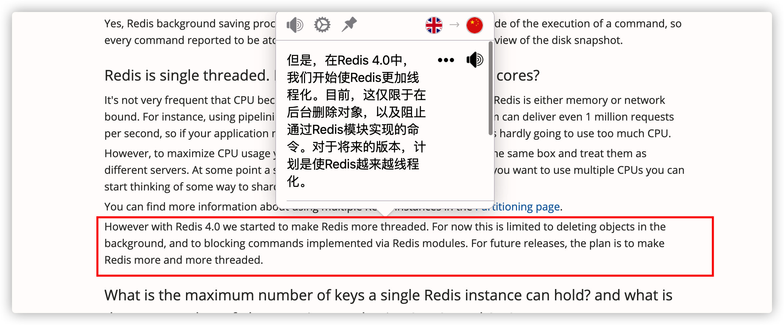

不过，Redis 4.0 增加的多线程主要是针对一些大键值对的删除操作的命令，使用这些命令就会使用主处理之外的其他线程来“异步处理”。

大体上来说，**Redis 6.0 之前主要还是单线程处理。**

**那，Redis6.0 之前 为什么不使用多线程？**

笔者觉得主要原因有下面 3 个：

1. 单线程编程容易并且更容易维护；
2. Redis 的性能瓶颈不在 CPU ，主要在内存和网络；
3. 多线程就会存在死锁、线程上下文切换等问题，甚至会影响性能。

### 5.5.10  Redis6.0 之后为何引入了多线程？

**Redis6.0 引入多线程主要是为了提高网络 IO 读写性能**，因为这个算是 Redis 中的一个性能瓶颈（Redis 的瓶颈主要受限于内存和网络）。

虽然，Redis6.0 引入了多线程，但是 Redis 的多线程只是在网络数据的读写这类耗时操作上使用了，执行命令仍然是单线程顺序执行。因此，你也不需要担心线程安全问题。

Redis6.0 的多线程默认是禁用的，只使用主线程。如需开启需要修改 redis 配置文件 `redis.conf` ：

```
io-threads-do-reads yes
```

开启多线程后，还需要设置线程数，否则是不生效的。同样需要修改 redis 配置文件 `redis.conf` :

```
io-threads 4 #官网建议4核的机器建议设置为2或3个线程，8核的建议设置为6个线程
```

推荐阅读：

1. [Redis 6.0 新特性-多线程连环 13 问！](https://mp.weixin.qq.com/s/FZu3acwK6zrCBZQ_3HoUgw)
2. [为什么 Redis 选择单线程模型](https://draveness.me/whys-the-design-redis-single-thread/)

###  5.5.11 Redis 给缓存数据设置过期时间有啥用？

一般情况下，我们设置保存的缓存数据的时候都会设置一个过期时间。为什么呢？

因为内存是有限的，如果缓存中的所有数据都是一直保存的话，分分钟直接 Out of memory。

Redis 自带了给缓存数据设置过期时间的功能，比如：

```
127.0.0.1:6379> exp key 60 # 数据在 60s 后过期
(integer) 1
127.0.0.1:6379> setex key 60 value # 数据在 60s 后过期 (setex:[set] + [ex]pire)
OK
127.0.0.1:6379> ttl key # 查看数据还有多久过期
(integer) 56
```

注意：**Redis 中除了字符串类型有自己独有设置过期时间的命令 `setex` 外，其他方法都需要依靠 `expire` 命令来设置过期时间 。另外， `persist` 命令可以移除一个键的过期时间。 **

**过期时间除了有助于缓解内存的消耗，还有什么其他用么？**

很多时候，我们的业务场景就是需要某个数据只在某一时间段内存在，比如我们的短信验证码可能只在 1 分钟内有效，用户登录的 token 可能只在 1 天内有效。

如果使用传统的数据库来处理的话，一般都是自己判断过期，这样更麻烦并且性能要差很多。

###  5.5.12 Redis 是如何判断数据是否过期的呢？

Redis 通过一个叫做过期字典（可以看作是 hash 表）来保存数据过期的时间。过期字典的键指向 Redis 数据库中的某个 key(键)，过期字典的值是一个 long long 类型的整数，这个整数保存了 key 所指向的数据库键的过期时间（毫秒精度的 UNIX 时间戳）。


过期字典是存储在 redisDb 这个结构里的：

```
typedef struct redisDb {
    ...

    dict *dict;     //数据库键空间,保存着数据库中所有键值对
    dict *expires   // 过期字典,保存着键的过期时间
    ...
}  redisDb;
```

### 5.5.13 淘汰机制与持久化机制

####  过期的数据的删除策略了解么？

如果假设你设置了一批 key 只能存活 1 分钟，那么 1 分钟后，Redis 是怎么对这批 key 进行删除的呢？

常用的过期数据的删除策略就两个（重要！自己造缓存轮子的时候需要格外考虑的东西）：

1. **惰性删除** ：只会在取出 key 的时候才对数据进行过期检查。这样对 CPU 最友好，但是可能会造成太多过期 key 没有被删除。
2. **定期删除** ： 每隔一段时间抽取一批 key 执行删除过期 key 操作。并且，Redis 底层会通过限制删除操作执行的时长和频率来减少删除操作对 CPU 时间的影响。

定期删除对内存更加友好，惰性删除对 CPU 更加友好。两者各有千秋，所以 Redis 采用的是 **定期删除+惰性/懒汉式删除** 。

但是，仅仅通过给 key 设置过期时间还是有问题的。因为还是可能存在定期删除和惰性删除漏掉了很多过期 key 的情况。这样就导致大量过期 key 堆积在内存里，然后就 Out of memory 了。

怎么解决这个问题呢？答案就是：**Redis 内存淘汰机制**

####  Redis 内存淘汰机制了解么？

> 相关问题：MySQL 里有 2000w 数据，Redis 中只存 20w 的数据，如何保证 Redis 中的数据都是热点数据?

Redis 提供 6 种数据淘汰策略：

1. **volatile-lru（least recently used）**：从已设置过期时间的数据集（server.db[i].expires）中挑选最近最少使用的数据淘汰
2. **volatile-ttl**：从已设置过期时间的数据集（server.db[i].expires）中挑选将要过期的数据淘汰
3. **volatile-random**：从已设置过期时间的数据集（server.db[i].expires）中任意选择数据淘汰
4. **allkeys-lru（least recently used）**：当内存不足以容纳新写入数据时，在键空间中，移除最近最少使用的 key（这个是最常用的）
5. **allkeys-random**：从数据集（server.db[i].dict）中任意选择数据淘汰
6. **no-eviction**：禁止驱逐数据，也就是说当内存不足以容纳新写入数据时，新写入操作会报错。这个应该没人使用吧！

4.0 版本后增加以下两种：

1. **volatile-lfu（least frequently used）**：从已设置过期时间的数据集（server.db[i].expires）中挑选最不经常使用的数据淘汰
2. **allkeys-lfu（least frequently used）**：当内存不足以容纳新写入数据时，在键空间中，移除最不经常使用的 key

#### Redis 持久化机制(怎么保证 Redis 挂掉之后再重启数据可以进行恢复)

很多时候我们需要持久化数据也就是将内存中的数据写入到硬盘里面，大部分原因是为了之后重用数据（比如重启机器、机器故障之后恢复数据），或者是为了防止系统故障而将数据备份到一个远程位置。

Redis 不同于 Memcached 的很重要一点就是，Redis 支持持久化，而且支持两种不同的持久化操作。**Redis 的一种持久化方式叫快照（snapshotting，RDB），另一种方式是只追加文件（append-only file, AOF）**。这两种方法各有千秋，下面我会详细这两种持久化方法是什么，怎么用，如何选择适合自己的持久化方法。

**快照（snapshotting）持久化（RDB）**

Redis 可以通过创建快照来获得存储在内存里面的数据在某个时间点上的副本。Redis 创建快照之后，可以对快照进行备份，可以将快照复制到其他服务器从而创建具有相同数据的服务器副本（Redis 主从结构，主要用来提高 Redis 性能），还可以将快照留在原地以便重启服务器的时候使用。

快照持久化是 Redis 默认采用的持久化方式，在 Redis.conf 配置文件中默认有此下配置：

```
save 900 1           #在900秒(15分钟)之后，如果至少有1个key发生变化，Redis就会自动触发BGSAVE命令创建快照。

save 300 10          #在300秒(5分钟)之后，如果至少有10个key发生变化，Redis就会自动触发BGSAVE命令创建快照。

save 60 10000        #在60秒(1分钟)之后，如果至少有10000个key发生变化，Redis就会自动触发BGSAVE命令创建快照。
```

**AOF（append-only file）持久化**

与快照持久化相比，AOF 持久化的实时性更好，因此已成为主流的持久化方案。默认情况下 Redis 没有开启 AOF（append only file）方式的持久化，可以通过 appendonly 参数开启：

```
appendonly yes
```

开启 AOF 持久化后每执行一条会更改 Redis 中的数据的命令，Redis 就会将该命令写入到内存缓存 `server.aof_buf` 中，然后再根据 `appendfsync` 配置来决定何时将其同步到硬盘中的 AOF 文件。

AOF 文件的保存位置和 RDB 文件的位置相同，都是通过 dir 参数设置的，默认的文件名是 `appendonly.aof`。

在 Redis 的配置文件中存在三种不同的 AOF 持久化方式，它们分别是：

```
appendfsync always    #每次有数据修改发生时都会写入AOF文件,这样会严重降低Redis的速度
appendfsync everysec  #每秒钟同步一次，显示地将多个写命令同步到硬盘
appendfsync no        #让操作系统决定何时进行同步
```

为了兼顾数据和写入性能，用户可以考虑 `appendfsync everysec` 选项 ，让 Redis 每秒同步一次 AOF 文件，Redis 性能几乎没受到任何影响。而且这样即使出现系统崩溃，用户最多只会丢失一秒之内产生的数据。当硬盘忙于执行写入操作的时候，Redis 还会优雅的放慢自己的速度以便适应硬盘的最大写入速度。

**相关 issue** ：[783：Redis 的 AOF 方式](https://github.com/Snailclimb/JavaGuide/issues/783)

**拓展：Redis 4.0 对于持久化机制的优化**

Redis 4.0 开始支持 RDB 和 AOF 的混合持久化（默认关闭，可以通过配置项 `aof-use-rdb-preamble` 开启）。

如果把混合持久化打开，AOF 重写的时候就直接把 RDB 的内容写到 AOF 文件开头。这样做的好处是可以结合 RDB 和 AOF 的优点, 快速加载同时避免丢失过多的数据。当然缺点也是有的， AOF 里面的 RDB 部分是压缩格式不再是 AOF 格式，可读性较差。

官方文档地址：https://redis.io/topics/persistence

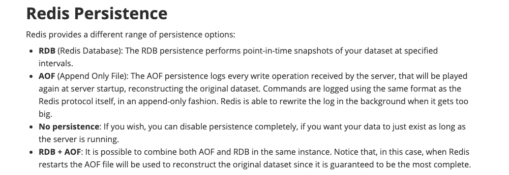

**补充内容：AOF 重写**

AOF 重写可以产生一个新的 AOF 文件，这个新的 AOF 文件和原有的 AOF 文件所保存的数据库状态一样，但体积更小。

**<u>AOF 重写是一个有歧义的名字</u>**，该功能是通过读取数据库中的键值对来实现的，程序无须对现有 AOF 文件进行任何读入、分析或者写入操作。

在执行 BGREWRITEAOF 命令时，Redis 服务器会维护一个 AOF 重写缓冲区，该缓冲区会在子进程创建新 AOF 文件期间，记录服务器执行的所有写命令。当子进程完成创建新 AOF 文件的工作之后，服务器会将重写缓冲区中的所有内容追加到新 AOF 文件的末尾，使得新旧两个 AOF 文件所保存的数据库状态一致。最后，服务器用新的 AOF 文件替换旧的 AOF 文件，以此来完成 AOF 文件重写操作。


### 5.5.1 redis的基本数据类型

### 5.5.2 为什么要使用redis

### 5.5.3 怎么样能确保缓存中数据和主存中数据的一致性?

#### 5.5.4 redis速度为什么这么快

# 6.Android

## 6.1 安卓的四大控件

- Activity：描述UI，并且处理用户与机器屏幕的交互。
- Services:  处理与应用程序关联的后台操作。
- Broadcast Receivers：处理Android操作系统和应用程序之间的通信。
- Content Providers：处理数据和数据库管理方面的问题。

## 6.2 安卓其它的控件

有一些附件的组件用于以上提到的实体、他们之间逻辑、及他们之间连线的构造。这些组件如下：

| 组件      | 描述                                             |
| :-------- | :----------------------------------------------- |
| Fragments | 代表活动中的一个行为或者一部分用户界面。         |
| Views     | 绘制在屏幕上的UI元素，包括按钮，列表等。         |
| Layouts   | 控制屏幕格式，展示视图外观的View的继承。         |
| Intents   | 组件间的消息连线。                               |
| Resources | 外部元素，例如字符串资源、常量资源及图片资源等。 |
| Manifest  | 应用程序的配置文件。                             |

## 6.3 Activity的生命周期

- onCreat 创建
- onStart 开始
- onResume 恢复
- onPause 暂停
- onStop 停止
- onDestroy 销毁


| onCreate()  | 这是第一个回调，在活动第一次创建时调用                       |
| ----------- | ------------------------------------------------------------ |
| onStart()   | 这个回调在活动为用户可见时被调用                             |
| onResume()  | 这个回调在应用程序与用户开始可交互的时候调用                 |
| onPause()   | 被暂停的活动无法接受用户输入，不能执行任何代码。当前活动将要被暂停，上一个活动将要被恢复时调用 |
| onStop()    | 当活动不在可见时调用                                         |
| onDestroy() | 当活动被系统销毁之前调用                                     |
| onRestart() | 当活动被停止以后重新打开时调用                               |

只有主线程才可以更新用户的界面

## 6.4 Service

服务是一个后台运行的组件，执行长时间运行且不需要用户交互的任务。即使应用被销毁也依然可以工作。服务基本上包含两种状态 -

| 状态    | 描述                                                         |
| :------ | :----------------------------------------------------------- |
| Started | Android的应用程序组件，如活动，通过startService()启动了服务，则服务是Started状态。一旦启动，服务可以在后台无限期运行，即使启动它的组件已经被销毁。 |
| Bound   | 当Android的应用程序组件通过bindService()绑定了服务，则服务是Bound状态。Bound状态的服务提供了一个客户服务器接口来允许组件与服务进行交互，如发送请求，获取结果，甚至通过IPC来进行跨进程通信。 |


 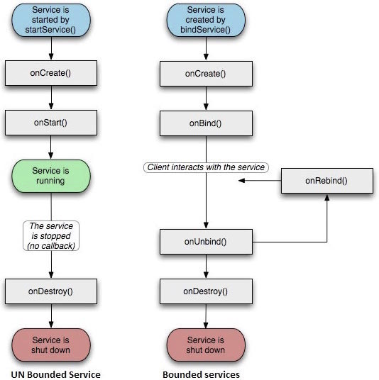


| 回调             | 描述                                                         |
| :--------------- | :----------------------------------------------------------- |
| onStartCommand() | 其他组件(如活动)通过调用startService()来请求启动服务时，系统调用该方法。如果你实现该方法，你有责任在工作完成时通过stopSelf()或者stopService()方法来停止服务。 |
| onBind           | 当其他组件想要通过bindService()来绑定服务时，系统调用该方法。如果你实现该方法，你需要返回IBinder对象来提供一个接口，以便客户来与服务通信。你必须实现该方法，如果你不允许绑定，则直接返回null。 |
| onUnbind()       | 当客户中断所有服务发布的特殊接口时，系统调用该方法。         |
| onRebind()       | 当新的客户端与服务连接，且此前它已经通过onUnbind(Intent)通知断开连接时，系统调用该方法。 |
| onCreate()       | 当服务通过onStartCommand()和onBind()被第一次创建的时候，系统调用该方法。该调用要求执行一次性安装。 |
| onDestroy()      | 当服务不再有用或者被销毁时，系统调用该方法。你的服务需要实现该方法来清理任何资源，如线程，已注册的监听器，接收器等。 |

## 6.5 Broadcast Receivers

广播接收器用于响应来自其他应用程序或者系统的广播消息。这些消息有时被称为事件或者意图。例如，应用程序可以初始化广播来让其他的应用程序知道一些数据已经被下载到设备，并可以为他们所用。这样广播接收器可以定义适当的动作来拦截这些通信。

有以下两个重要的步骤来使系统的广播意图配合广播接收器工作。

- 创建广播接收器
- 注册广播接收器

还有一个附加的步骤，要实现自定义的意图，你必须创建并广播这些意图。

### 创建广播接收器

广播接收器需要实现为BroadcastReceiver类的子类，并重写onReceive()方法来接收以Intent对象为参数的消息。

```java
public class MyReceiver extends BroadcastReceiver {
   @Override
   public void onReceive(Context context, Intent intent) {
      Toast.makeText(context, "Intent Detected.", Toast.LENGTH_LONG).show();
   }
}
```

### 注册广播接收器


应用程序通过在AndroidManifest.xml中注册广播接收器来监听制定的广播意图。假设我们将要注册MyReceiver来监听系统产生的ACTION_BOOT_COMPLETED事件。该事件由Android系统的启动进程完成时发出。

```xml
<application
   android:icon="@drawable/ic_launcher"
   android:label="@string/app_name"
   android:theme="@style/AppTheme" >
   <receiver android:name="MyReceiver">

      <intent-filter>
         <action android:name="android.intent.action.BOOT_COMPLETED">
         </action>
      </intent-filter>

   </receiver>
</application>
```

现在，无论什么时候Android设备被启动，都将被广播接收器MyReceiver所拦截，并且在onReceive()中实现的逻辑将被执行。

有许多系统产生的事件被定义为类Intent中的静态常量值。下面的表格列举了重要的系统事件。

| 事件常量                              | 描述                                                 |
| :------------------------------------ | :--------------------------------------------------- |
| android.intent.action.BATTERY_CHANGED | 持久的广播，包含电池的充电状态，级别和其他信息。     |
| android.intent.action.BATTERY_LOW     | 标识设备的低电量条件。                               |
| android.intent.action.BATTERY_OKAY    | 标识电池在电量低之后，现在已经好了。                 |
| android.intent.action.BOOT_COMPLETED  | 在系统完成启动后广播一次。                           |
| android.intent.action.BUG_REPORT      | 显示报告bug的活动。                                  |
| android.intent.action.CALL            | 执行呼叫数据指定的某人。                             |
| android.intent.action.CALL_BUTTON     | 用户点击"呼叫"按钮打开拨号器或者其他拨号的合适界面。 |
| android.intent.action.DATE_CHANGED    | 日期发生改变。                                       |
| android.intent.action.REBOOT          | 设备重启。                                           |

### 广播自定义意图

如果你想要应用程序中生成并发送自定义意图，你需要在活动类中通过sendBroadcast()来创建并发送这些意图。如果你使用sendStickyBroadcast(Intent)方法，则意图是持久的(sticky)，这意味者你发出的意图在广播完成后一直保持着。

```java
public void broadcastIntent(View view)
{
   Intent intent = new Intent();
   intent.setAction("com.runoob.CUSTOM_INTENT");
   sendBroadcast(intent);
}
```

com.runoob.CUSTOM_INTENT的意图可以像之前我们注册系统产生的意图一样被注册。

```xml
<application
   android:icon="@drawable/ic_launcher"
   android:label="@string/app_name"
   android:theme="@style/AppTheme" >
   <receiver android:name="MyReceiver">

      <intent-filter>
         <action android:name="com.runoob.CUSTOM_INTENT">
         </action>
      </intent-filter>

   </receiver>
</application>
```

## 6.6 内容提供者(Content Provider)

内容提供者组件通过请求从一个应用程序向其他的应用程序提供数据。这些请求由类 ContentResolver 的方法来处理。内容提供者可以使用不同的方式来存储数据。数据可以被存放在数据库，文件，甚至是网络。


有时候需要在应用程序之间共享数据。这时内容提供者变得非常有用。

内容提供者可以让内容集中，必要时可以有多个不同的应用程序来访问。内容提供者的行为和数据库很像。你可以查询，编辑它的内容，使用 insert()， update()， delete() 和 query() 来添加或者删除内容。多数情况下数据被存储在 SQLite 数据库。

内容提供者被实现为类 ContentProvider 类的子类。需要实现一系列标准的 API，以便其他的应用程序来执行事务。

```java
public class MyApplication extends  ContentProvider {

}
```

### 内容URI

要查询内容提供者，你需要以如下格式的URI的形式来指定查询字符串：

```
<prefix>://<authority>/<data_type>/<id>
```

以下是URI中各部分的具体说明：

| 部分      | 说明                                                         |
| :-------- | :----------------------------------------------------------- |
| prefix    | 前缀：一直被设置为content://                                 |
| authority | 授权：指定内容提供者的名称，例如联系人，浏览器等。第三方的内容提供者可以是全名，如：cn.programmer.statusprovider |
| data_type | 数据类型：这个表明这个特殊的内容提供者中的数据的类型。例如：你要通过内容提供者Contacts来获取所有的通讯录，数据路径是people，那么URI将是下面这样：content://contacts/people |
| id        | 这个指定特定的请求记录。例如：你在内容提供者Contacts中查找联系人的ID号为5，那么URI看起来是这样：content://contacts/people/5 |

### 创建内容提供者

这里描述创建自己的内容提供者的简单步骤。

- 首先，你需要继承类 ContentProviderbase 来创建一个内容提供者类。
- 其次，你需要定义用于访问内容的你的内容提供者URI地址。
- 接下来，你需要创建数据库来保存内容。通常，Android 使用 SQLite 数据库，并在框架中重写 onCreate() 方法来使用 SQLiteOpenHelper 的方法创建或者打开提供者的数据库。当你的应用程序被启动，它的每个内容提供者的 onCreate() 方法将在应用程序主线程中被调用。
- 最后，使用<provider.../>标签在 AndroidManifest.xml 中注册内容提供者。

以下是让你的内容提供者正常工作，你需要在类 ContentProvider 中重写的一些方法：

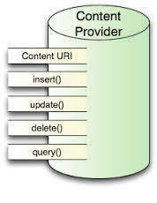

- onCreate():当提供者被启动时调用。
- query():该方法从客户端接受请求。结果是返回指针(Cursor)对象。
- insert():该方法向内容提供者插入新的记录。
- delete():该方法从内容提供者中删除已存在的记录。
- update():该方法更新内容提供者中已存在的记录。
- getType():该方法为给定的URI返回元数据类型。

## 6.7 碎片

碎片是活动的一部分，使得活动更加的模块化设计。我们可以认为碎片是一种子活动。

下面是关于碎片的重要知识点 -

- 碎片拥有自己的布局，自己的行为及自己的生命周期回调。
- 当活动在运行的时候，你可以在活动中添加或者移除碎片。
- 你可以合并多个碎片在一个单一的活动中来构建多栏的UI。
- 碎片可以被用在多个活动中。
- 碎片的生命周期和它的宿主活动紧密关联。这意味着活动被暂停，所有活动中的碎片被停止。
- 碎片可以实现行为而没有用户界面组件。
- 碎片是 Android API 版本11中被加入到 Android API。

通过继承 Fragment 类来创建碎片。可以通过使用 元素在活动的布局文件中声明碎片来在你的活动中插入碎片。

在引入碎片之前，由于每次给定的一个时间点在屏幕上只能显示单一的活动，因此我们有一个局限。我们无法分割设备屏幕并且独立的控制不同的部分。伴随着碎片的引入，我们获得了更大的灵活性，并使得一个时间点只能在屏幕上有一个单一活动的限制被移除。现在我们可以有单一的活动，但每个活动由多个碎片组装，每个碎片有自己的布局，事件和完整的生命周期。

下面是一个典型的示例演示如何让两个由碎片定义的UI模块，在为平板设计的活动中组合，在为手持设备设计的活动中分离。


当运行在在平板尺寸的设备上，这个应用程序可以在活动A中嵌入两个碎片。在手机设备屏幕上，由于没有足够的空间，活动A仅包含有文章列表的碎片，当用户点击文章时，启动包含第二个碎片的活动B来阅读文章。

### 碎片的生命周期

Android 的碎片拥有自己的生命周期，与 Android 的活动很相似。下面简单介绍它生命周期的不同阶段。


这是在类fragment中你可以重写的方法列表：

- onAttach(): 碎片实例被关联到活动实例。碎片和活动还没有完全初始化。通常，你在该方法中获取到活动的引用，在碎片将来的初始化工作中被使用。
- onCreate(): 当创建碎片时，系统调用该方法。你需要初始化一些碎片的必要组件。这些组件是当碎片被暂停、停止时需要保留的，以便被恢复。
- onCreateView(): 当碎片将要第一次绘制它的用户界面时系统调用该方法。为了绘制碎片的UI，你需要从该方法中返回一个代表碎片根布局的View组件。如果该碎片不提供用户界面，直接返回null。
- onActivityCreated: 当宿主活动被创建，在onCreateView()方法之后调用该方法。活动和碎片实例与活动的视图层级被创建。这时，视图可以通过findViewById()方法来访问。在这个方法中，你可以实例化需要Context对象的对象。
- onStart(): 碎片可见时调用该方法。
- onResume(): 碎片可交互时调用该方法。
- onPause(): 当首次表明用户将要离开碎片时系统调用该方法。通常，这里你需要提交任何的会超出用户会话的持久化的变化。
- onStop(): 碎片将要被停止时调用。
- onDestroyView(): 调用该方法后，碎片将要被销毁。
- onDestroy(): 该方法被用来清理碎片的状态。但在Android平台并不保证一定被调用。

### 如何使用碎片？

这里介绍创建碎片的简单步骤。

- 首先决定在活动中需要使用多少个碎片。例如，我们需要使用两个碎片来处理设备的横屏和竖屏两种模式。
- 下一步，基于碎片数量，创建继承自类Fragment的类。类Fragment包含上面提到的回调函数。根据你的需求重写任意的方法。
- 对应每个片段，你需要在XML文件中创建布局。这些文件中包含已定义的碎片的布局。
- 最后，基于需求修改活动文件来定义实际的碎片替换逻辑。

### 碎片类型

基本的碎片可以分为如下所示的三种：

- [单帧碎片](https://www.runoob.com/android/android-single-fragment.html) - 单帧碎片被如移动电话之类的手持设备使用。一个碎片如同一个视频一样显示。
- [列表碎片](https://www.runoob.com/android/android-list-fragment.html) - 包含有特殊列表视图的碎片被叫做列表碎片。
- [碎片过渡](https://www.runoob.com/android/android-fragment-transitions.html) - 与碎片事务一起使用。可以从一个碎片移动到另外一个碎片。

## 6.8 意图 Intent

Android意图是一个要执行的操作的抽象描述。它可以通过 startActivity 来启动一个活动，broadcastIntent 来发送广播到任何对它感兴趣的广播接受器组件，startService(Intent) 或者bindService(Intent， ServiceConnection, int) 来与后台服务通讯。

意图本身（一个 Intent 对象）是一个被动的数据结构，保存着要执行操作的抽象描述。

例如，你有一个活动，需要打开邮件客户端并通过 Android 设备来发送邮件。为了这个目的，你的活动需要发送一个带有合适选择器的 ACTION_SEND 到 Android 意图处理者。指定的选择器给定合适的界面来让用户决定如何发送他的邮件数据

```java
Intent email = new Intent(Intent.ACTION_SEND, Uri.parse("mailto:"));
email.putExtra(Intent.EXTRA_EMAIL, recipients);
email.putExtra(Intent.EXTRA_SUBJECT, subject.getText().toString());
email.putExtra(Intent.EXTRA_TEXT, body.getText().toString());
startActivity(Intent.createChooser(email, "Choose an email client from..."));
```

上面的语法调用 startActivity 方法来开启邮件活动，代码运行结果看起来像这样：


例如，你有一个活动，需要在 Android 设备上通过浏览器打开一个URL。为了这个目的，你的活动发送 ACTION_WEB_SEARCH 意图到 Android 意图处理器来在浏览器中打开给定的 URL 。意图处理器通过解析一系列活动，并选择最适合你的意图的一个活动，在这个例子中，是 Web 浏览器活动。意图处理器传递你的网页地址到 Web 浏览器，并打开 Web 浏览器活动

```java
String q = "https://www.runoob.com";
Intent intent = new Intent(Intent.ACTION_WEB_SEARCH );
intent.putExtra(SearchManager.QUERY, q);
startActivity(intent);
```

上面的例子将在Android搜索引擎上查找"www.runoob.com"，并在一个活动上给出关键词的结果。

对于每一个组件-活动，服务，广播接收器都有独立的机制来传递意图。

| 序号 | 方法和描述                                                   |
| :--- | :----------------------------------------------------------- |
| 1    | Context.startActivity():意图传递给该方法，用于启动一个新的活动或者让已存在的活动做一些新的事情。 |
| 2    | Context.startService():意图传递给该方法，将初始化一个服务，或者新的信息到一个持续存在的服务。 |
| 3    | Context.sendBroadcast():意图传递给该方法，信息将传递到所有对此感兴趣的广播接收器。 |

### 意图对象

意图对象是一包的信息，用于组件接收到的意图就像 Android 系统接受到的信息。

意图对象包括如下的组件，具体取决于要通信或者执行什么。

动作(Action)

这是意图对象中必须的部分，被表现为一个字符串。在广播的意图中，动作一旦发生，将会被报告。动作将很大程度上决定意图的其他部分如何被组织。Intent 类定义了一系列动作常量对应不同的意图。这里是一份[Android意图标准动作 ](https://www.runoob.com/android/android-intents-filters.html)列表。

意图对象中的动作可以通过 setAction() 方法来设置，通过 getAction() 方法来读取。

数据(Data)

添加数据规格到意图过滤器。这个规格可以只是一个数据类型(如元类型属性)，一条 URI ，或者同时包括数据类型和 URI 。 URI 则由不同部分的属性来指定。

这些指定 URL 格式的属性是可选的，但是也相互独立 -

- 如果意图过滤器没有指定模式，所有其他的 URI 属性将被忽略。
- 如果没有为过滤器指定主机，端口属性和所有路径属性将被忽略。

setData() 方法只能以 URI 来指定数据，setType() 只能以元类型指定数据，setDataAndType() 可以同时指定 URI 和元类型。URI 通过 getData() 读取，类型通过 getType() 读取。

以下是动作/数据组的一些实例 -

| 序号 | 动作/数据组和描述                                            |
| :--- | :----------------------------------------------------------- |
| 1    | ACTION_VIEW content://contacts/people/1：显示ID为1的用户的信息。 |
| 2    | ACTION_DIAL content://contacts/people/1：显示电话拨号器，并填充用户1的数据。 |
| 3    | ACTION_VIEW tel:123：显示电话拨号器，并填充给定的号码。      |
| 4    | ACTION_DIAL tel:123：显示电话拨号器，并填充给定的号码。      |
| 5    | ACTION_EDIT content://contacts/people/1：编辑ID为1的用户信息。 |
| 6    | ACTION_VIEW content://contacts/people/：显示用户列表，以便查看。 |
| 7    | ACTION_SET_WALLPAPER：显示选择壁纸设置。                     |
| 8    | ACTION_SYNC：同步数据，默认的值为：android.intent.action.SYNC |
| 9    | ACTION_SYSTEM_TUTORIAL：开启平台定义的教程（默认教程或者启动教程） |
| 10   | ACTION_TIMEZONE_CHANGED：当时区被改变时通知                  |
| 11   | ACTION_UNINSTALL_PACKAGE：运行默认的卸载器                   |

类别

类别是意图中可选的部分，是一个字符串，包含该类型组件需要处理的意图的附加信息。addCategory() 方法为意图对象添加类别，removeCategory() 方法删除之前添加的类别，getCategories() 获取所有被设置到意图对象中的类别。这里是[Android意图标准类别](https://www.runoob.com/android/android-intents-filters.html)列表。

可以查看下面章节中的意图过滤器来了解我们如何使用类别来通过对应的意图选择合适的活动。

附加数据

这是传递给需要处理意图的组件的以键值对描述的附加信息。通过 putExtras() 方法设置，getExtras() 方法读取。这里是[Android意图标准附加数据](https://www.runoob.com/android/android-intents-filters.html)列表。

标记

这些标记是意图的可选部分，说明Android系统如何来启动活动，启动后如何处理等。

| 序号 | 标记和说明                                                   |
| :--- | :----------------------------------------------------------- |
| 1    | FLAG_ACTIVITY_CLEAR_TASK :如果在意图中设置，并通过 Context.startActivity 传递，这个标记将导致与该活动相关联的所有已存在的任务在活动启动前被清空。活动将成为一个空任务的根，所有旧的活动被结束。该标记可以与 FLAG_ACTIVITY_NEW_TASK 结合使用。 |
| 2    | FLAG_ACTIVITY_CLEAR_TOP :如果设置该标记，活动将在当前运行的任务中被启动。这并不会启动一个新的活动实例，所有的在它之上的活动被关闭，这个意图作为一个新的意图被传递到已有的（目前在顶部的）活动。 |
| 3    | FLAG_ACTIVITY_NEW_TASK :这个标记一般用于使得活动用于"启动器"风格的行为：为用户提供一个可以独立完成运行的数据，并启动完整儿独立的活动。 |

组件名称

组件名称对象是一个可选的域，代表活动、服务或者广播接收器类。如果设置，则意图对象被传递到实现设计好的类的实例，否则，Android 使用其他意图

意图的类型

Android 支持两种类型的意图。

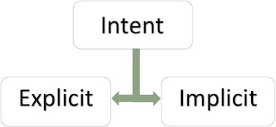

显式意图

显式意图用于连接应用程序的内部世界，假设你需要连接一个活动到另外一个活动，我们可以通过显示意图，下图显示通过点击按钮连接第一个活动到第二个活动。

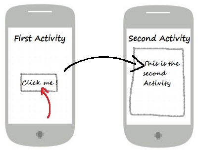

这些意图通过名称指定目标组件，一般用于应用程序内部信息 - 比如一个活动启动一个下属活动或者启动一个兄弟活动。举个例子：

```java
// 通过指定类名的显式意图
Intent i = new Intent(FirstActivity.this, SecondAcitivity.class);

// 启动目标活动
startActivity(i);
```

隐式意图

这些意图没有为目标命名，组件名称的域为空。隐式意图经常用于激活其他应用程序的组件。举个例子：

```java
Intent read1=new Intent();
read1.setAction(android.content.Intent.ACTION_VIEW);
read1.setData(ContactsContract.Contacts.CONTENT_URI);
startActivity(read1);
```

上面的代码将给出如下结果：

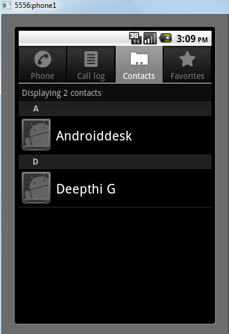

目标组件接收到意图，可以使用getExtras()方法来获取由源组件发送的附加数据。例如：

```java
// 在代码中的合适位置获取包对象
Bundle extras = getIntent().getExtras();

// 通过键解压数据
String value1 = extras.getString("Key1");
String value2 = extras.getString("Key2");
```

## 6.9 handler （需要重点理解）

### 6.9.1 什么是handle?

handler是Android给我们提供用来更新UI的一套机制，也是一套消息处理机制，我们可以发消息，也可以通过它处理消息。

在官方的描述中提到了Handler两个主要作用：

- 延时处理消息或者Runnable
- 跨进程通信

**Handler不仅可以完成主线程与子线程之间的通信，也可以做到子线程与子线程之间的通信**

### 6.9.2  可以不使用handle吗？

因为android在设计的时候就封装了一套消息创建、传递、处理。如果不遵循就不能更新UI信息，就会报出异常。

### 6.9.3 安卓为什么要使用handle?

最根本的目的就是为了解决多线程并发的问题！

​      打个比方，如果在一个activity中有多个线程，并且没有加锁，就会出现界面错乱的问题。但是如果对这些更新UI的操作都加锁处理，又会导致性能下降。处于对性能的问题考虑，Android给我们提供这一套更新UI的机制我们只需要遵循这种机制就行了。不用再去关系多线程的问题，所有的更新UI的操作，都是在主线程的消息队列中去轮训的。

### 6.9.4 Handle的工作机制

- 1.Message 消息，理解为线程间通讯的数据单元。例如后台子线程在处理数据完毕后需要更新UI，则可发送一条包含更新信息的Message给UI线程。
- 2.Message Queue 消息队列，用来存放通过Handler发布的消息，按照先进先出执行。

- 3.Handler是Message的主要处理者，负责将Message添加到消息队列以及对消- 息队列中的Message进行处理。

- 4.Looper 循环器，扮演Message Queue和Handler之间桥梁的角色，循环取出Message
  Queue里面的Message，并交付给相应的Handler进行处理。

### 6.9.5 handler有哪些缺点？

- 使用不方便
- 内存泄漏

## 6.10 LIfeCycle （生命周期感知型组件）与 LiveData

### 6.10.1 LifeCycle

简单的说就是用来监听Activity与Fragment的生命周期变化。

#### 为什么需要使用LIfeCycle？

生命周期感知型组件可执行操作来响应另一个组件（如 Activity 和 Fragment）的生命周期状态的变化。这些组件有助于您写出更有条理且往往更精简的代码，这样的代码更易于维护。

在开发的时候，很多时候需要统计页面的周期。比如我们需要把打开的Activity都保存起来,在不修改baseActivity的方式下，我们可以通过在application中注册一个监听Activity的生命周期的方法。

举一下我们最常用的 MVP 例子，没引进 lifecycle 之前，我们需要在 Activity 或者 Fragment 销毁的时候，即 onDestroy 的时候手动调用 onDestroy 方法，这里会带来一些问题，每一次在 Activity 或者 Fragment 销毁的烧开后都要调用 presenter.destory() 方法，这样的代码枯燥，毫无意义。

```java
class MyPresenter{
    public MyPresenter() {
    }

    void create() {
        //do something
    }

    void destroy() {
        //do something
    }
}

class MyActivity extends AppCompatActivity {
    private MyPresenter presenter;

    public void onCreate(...) {
        presenter= new MyPresenter ();
        presenter.create();
    }

    public void onDestroy() {
        super.onDestroy();
        presenter.destory();
    }
}
```

小结：

1. lifycycle 其实是用观察者模式实现的，当 Activity 生命周期变化的时候，通知相应的 Observers 即观察者。
2. 使用 lifecycle，我们可以将释放资源的动作内聚在自身，减少与调用者之间的耦合。

### 6.10.1 LiveData

LiveData 是一个可以被观察的数据持有类，它可以感知 Activity、Fragment或Service 等组件的生命周期。简单来说，他主要有一下优点。

它可以做到在组件处于激活状态的时候才会回调相应的方法，从而刷新相应的 UI，不用担心发生内存泄漏。

当 config 导致 activity 重新创建的时候，不需要手动取处理数据的储存和恢复。它已经帮我们封装好了。
当 Actiivty 不是处于激活状态的时候，如果你想 livedata setValue 之后立即回调 obsever 的 onChange 方法，而不是等到 Activity 处于激活状态的时候才回调 obsever 的 onChange 方法，你可以使用 observeForever 方法，但是你必须在 onDestroy 的时候 

回想一下，在你的项目中，是不是经常会碰到这样的问题，当网络请求结果回来的时候，你经常需要判断 Activity 或者 Fragment 是否已经 Destroy， 如果不是 destroy，才更新 UI。

而当你如果使用 Livedata 的话，因为它是在 Activity 处于 onStart 或者 onResume 的状态时，他才会进行相应的回调，因而可以很好得处理这个问题，不必写一大堆的 activity.isDestroyed()。接下来，让我们一起来看一下 LiveData 的使用。

## 6.11  安卓常见的视图控件们

### 6.11.1 安卓布局

Android中常用的5大布局方式有以下几种：

- 线性布局（LinearLayout）：按照垂直或者水平方向布局的组件
- 帧布局（FrameLayout）：组件从屏幕左上方布局组件
- 表格布局（TableLayout）：按照行列方式布局组件，表格布局是线性布局的子类。
- 相对布局（RelativeLayout）：相对其它组件的布局方式
- 绝对布局（AbsoluteLayout）：按照绝对坐标来布局组件
- 网格布局（GridLayout）
- ConstraintLayout（约束布局）新，主要是为了可以实现在设计模式中完成UI绘制。

需要注意的点：

如何分辨margin与padding?

- margin 内边距
- padding 外边距

## 6.12 事件分发机制

## 6.13 Glide 缓存机制


## 6.14 启动模式

- standard(默认)
- singleTop
- singleTast
- singleInstance

## 6.15 MVC MCP MVVM

MVP中view和presenter互相怎么调用？

## 6.16 自定义组件

## 6.17 依赖注入


# 7.操作系统

## 7.1 IO

### 7.1.1 Java IO 有哪些？

UNIX 系统下， IO 模型一共有 5 种： **同步阻塞 I/O**、**同步非阻塞 I/O**、**I/O 多路复用**、**信号驱动 I/O** 和**异步 I/O**。

这也是我们经常提到的 5 种 IO 模型。

### 7.1.2 BIO NIO AIO的区别

### BIO (Blocking I/O)

**BIO 属于同步阻塞 IO 模型** 。

同步阻塞 IO 模型中，应用程序发起 read 调用后，会一直阻塞，直到内核把数据拷贝到用户空间。

在客户端连接数量不高的情况下，是没问题的。但是，当面对十万甚至百万级连接的时候，传统的 BIO 模型是无能为力的。因此，我们需要一种更高效的 I/O 处理模型来应对更高的并发量。

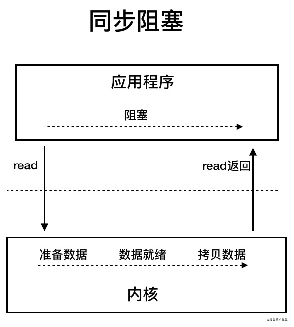

###  NIO (Non-blocking/New I/O)

Java 中的 NIO 于 Java 1.4 中引入，对应 `java.nio` 包，提供了 `Channel` , `Selector`，`Buffer` 等抽象。NIO 中的 N 可以理解为 Non-blocking，不单纯是 New。它支持面向缓冲的，基于通道的 I/O 操作方法。 对于高负载、高并发的（网络）应用，应使用 NIO 。

Java 中的 NIO 可以看作是 **I/O 多路复用模型**。也有很多人认为，Java 中的 NIO 属于同步非阻塞 IO 模型。

跟着我的思路往下看看，相信你会得到答案！

我们先来看看 **同步非阻塞 IO 模型**。


同步非阻塞 IO 模型中，应用程序会一直发起 read 调用，等待数据从内核空间拷贝到用户空间的这段时间里，线程依然是阻塞的，直到在内核把数据拷贝到用户空间。

相比于同步阻塞 IO 模型，同步非阻塞 IO 模型确实有了很大改进。通过轮询操作，避免了一直阻塞。

但是，这种 IO 模型同样存在问题：**应用程序不断进行 I/O 系统调用轮询数据是否已经准备好的过程是十分消耗 CPU 资源的。**

这个时候，**I/O 多路复用模型** 就上场了。

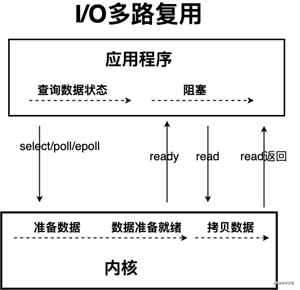

IO 多路复用模型中，线程首先发起 select 调用，询问内核数据是否准备就绪，等内核把数据准备好了，用户线程再发起 read 调用。read 调用的过程（数据从内核空间->用户空间）还是阻塞的。

> 目前支持 IO 多路复用的系统调用，有 select，epoll 等等。select 系统调用，是目前几乎在所有的操作系统上都有支持
>
> - **select 调用** ：内核提供的系统调用，它支持一次查询多个系统调用的可用状态。几乎所有的操作系统都支持。
> - **epoll 调用** ：linux 2.6 内核，属于 select 调用的增强版本，优化了 IO 的执行效率。

**IO 多路复用模型，通过减少无效的系统调用，减少了对 CPU 资源的消耗。**

Java 中的 NIO ，有一个非常重要的**选择器 ( Selector )** 的概念，也可以被称为 **多路复用器**。通过它，只需要一个线程便可以管理多个客户端连接。当客户端数据到了之后，才会为其服务。


###  AIO (Asynchronous I/O)

AIO 也就是 NIO 2。Java 7 中引入了 NIO 的改进版 NIO 2,它是异步 IO 模型。

异步 IO 是基于事件和回调机制实现的，也就是应用操作之后会直接返回，不会堵塞在那里，当后台处理完成，操作系统会通知相应的线程进行后续的操作

AIO 也就是 NIO 2。Java 7 中引入了 NIO 的改进版 NIO 2,它是异步 IO 模型。

异步 IO 是基于事件和回调机制实现的，也就是应用操作之后会直接返回，不会堵塞在那里，当后台处理完成，操作系统会通知相应的线程进行后续的操作


目前来说 AIO 的应用还不是很广泛。Netty 之前也尝试使用过 AIO，不过又放弃了。这是因为，Netty 使用了 AIO 之后，在 Linux 系统上的性能并没有多少提升。

最后，来一张图，简单总结一下 Java 中的 BIO、NIO、AIO。


### 7.1.2 什么是IO多路复用

# 8.算法题

## 8.1 给出一个数组判断数组中，是不是二叉搜索树的后序遍历


